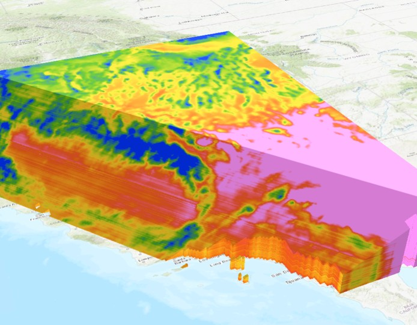

# About Us...

```{r setup, include = FALSE}
knitr::opts_chunk$set(echo = TRUE)
library(caladaptr)
library(DiagrammeR)  ## has a conflict with leaflet, must go high up in the pecking order
library(knitr)
library(kableExtra)
library(magrittr)
library(dplyr)
library(tidyr)
library(sf)
library(leaflet)
library(tmap)
```

```{css echo = FALSE}
div.slide.titlepage h1 {
  padding-top:5%;
}

h1 {
  color:darkgreen;
}
h1.title {
  color:black;
  font-size:130%;
}
h2 {
  color:#444;
  font-size: 1.2em;
}
span.revlabel {
  border-radius:3px;
  font-size:60%;
  padding:2px 4px;
  margin-right:1em;
  background-color:MediumSeaGreen;
  color:white;
}
span.chk {
  color:DarkGreen;
}

.indented1 {
  margin-left:1em;
}
div.indented2 {
  margin-left:2em;
}
p.date {
  text-align:left;
}
table.borderme {
  border:2px solid gray;
  border-collapse:collapse;
}

table.borderme td {
  border: 1px solid #eee;
}

table.shademe td {
  background:#eee;
  padding:8px;
}

div.li-single li {
  margin-bottom:0.1em;
} 
.test_delete {
  line-height:0.7em;
}
pre {
  font-weight:normal;
  font-size:80%;
}
div.space_images > p > img {
  margin-bottom:4em;
}
div.code-sample {
  font-family: monospace;
  font-weight: normal;
  color:DarkOliveGreen;
  margin-left:0;
  margin-bottom:2em;
}
```


```{js echo = FALSE}
w3c_slidy.mouse_click_enabled = false;
```


# Thanks also to ...

<div class = "indented2 li-single">
- Brian Galey  
- Lucy Andrews 
- Eric Lehmer
- Shruti Mukhtyar
- Nancy Thomas  
- Maggi Kelly  
</div>

\

<center>

{style="height:118px; margin-left:3em;"}
{style="height:118px; margin-left:3em;"}
</center>


# Cal-Adapt

Cal-Adapt is California's **official portal** for **peer-reviewed** climate data. 

Datasets are selected with guidance and priorities from California State agencies. 

Modeled Climate Data:

<div style="width:400px; float:left; margin-left:3em;">
- temperature <span class="revlabel">6 km</span>  
- precipitation <span class="revlabel">6 km</span>  
- snow water equivalent <span class="revlabel">6 km</span>  
- relative humidity <span class="revlabel">6 km</span>  
- surface solar radiation <span class="revlabel">6 km</span>  
- wind speed
</div>

<div style="width:400px; float:left;">
- wildfire risk
- drought scenarios
- streamflow
- sea level rise
- other derived variables
</div>

<div style="clear:both;"></div>

See also: [*What climate data does Cal-Adapt provide?*](https://beta.cal-adapt.org/help/get-started/climate-data-and-other-data-on-caladapt/){target="_blank" rel="noopener"}

Spatial extent of LOCA downscaled climate data layers:


\

   

# Cal-Adapt Data


# Options for Accessing Cal-Adapt Data

```{r getting_data_options, echo=FALSE, results='asis', cache=FALSE}
tbl_vec <- c("Feature", "Cal-Adapt website", "Cal-Adapt FTP", "caladapt-py",
             "caladaptR",
             
             "Download rasters", "", "", "", "",
             "Statewide", "<span class='chk'>&#10004;</span>", "<span class='chk'>&#10004;</span>", "<span class='chk'>&#10004;</span>", "<span class='chk'>&#10004;</span>",
             "User area-of-interest", "<span class='chk'>&#10004;</span>", "", "<span class='chk'>&#10004;</span>", "<span class='chk'>&#10004;</span>",
             "10 recommended GCMs", "<span class='chk'>&#10004;</span>", "<span class='chk'>&#10004;</span>", "<span class='chk'>&#10004;</span>", "<span class='chk'>&#10004;</span>",
             "All 32 GCMs", "", "<span class='chk'>&#10004;</span>", "<span class='chk'>&#10004;</span>", "",
             
             "Query features", "", "", "", "",
             "Points (user-provided)", "<span class='chk'>&#10004;</span>", "", "<span class='chk'>&#10004;</span>", "<span class='chk'>&#10004;</span>",
             "Lines (user-provided)", "<span class='chk'>&#10004;</span>", "", "<span class='chk'>&#10004;</span>", "",
             "Polygons (user-provided)", "<span class='chk'>&#10004;</span>", "", "<span class='chk'>&#10004;</span>", "<span class='chk'>&#10004;</span>",
             "Polygons (presets, boundary layers)", "<span class='chk'>&#10004;</span>", "", "", "<span class='chk'>&#10004;</span>",
             
             "Other", "", "", "", "",
             "Extract underlying tables from preset charts", "<span class='chk'>&#10004;</span>", "", "", "")

tbl_mat <- matrix(tbl_vec, byrow=TRUE, ncol=5)

knitr::kable(tbl_mat, format = "html", align = c("l", "c", "c", "c", "c"), 
             table.attr="class='borderme'", escape = FALSE) %>% 
  column_spec(1, width = "15em") %>%
  row_spec(1, bold=TRUE, background = gray(0.80), color = "black", align = "c", extra_css = "padding:0.5em 1em;") %>%
  row_spec(c(2,7,12), bold=TRUE, background = gray(0.9), italic = TRUE) %>% 
  kable_styling(full_width = FALSE)

```

More info:

<div class="indented2">
- [*New Data Download Tool*](https://cal-adapt.org/blog/data-download){target="_blank" rel="noopener"}, Cal-Adapt Blog, June 2019
</div>

# Why would you want to work with Cal-Adapt data in R or Python?

Short answer: to mitigate 


## Custom Visualization 
 
## Integrate results with other data
 
 <div class="indented2 li-single">
 - census data  
 - biodiversity / habitat  
 - economic data
 </div>
 
## Take advantage of other R packages

## Run custom models

## Research
 
## Custom decision support

---

{style='height:80px;'}

https://ucanr-igis.github.io/caladapt-py/

<div class="indented1 li-single">
- Jupytr Notebooks  
- ArcGIS Pro toolbox
</div>

  {style="height:333px; margin-left:2em;"}

{style="height:32px;"} [**Intro to Jupyter Notebooks in ArcGIS Pro**](https://www.youtube.com/watch?v=rV4330_yScs&t=7s){target="_blank" rel="noopener" }, workshop Nov 2021 


# caladaptR

{style="float:right; padding:0.5em;"}


<div class = "indented2 li-single">

- `caladaptr` is an **API client** package  
- main job is to provide low-level functions for **querying** and **importing** Cal-Adapt data via the API  
- uses modern R programming standards:  
- Retrieve values from *any* Cal-Adapt raster series  
- Query with **user-provided** points and polygons  
- Query built-in **preset** areas-of-interest  
- Download climate variables as **tibbles** (data frames) or **rasters** (tiffs & stars)
</div>

\

# Quick Example

{style="float:right; padding:0.5em;"}

1. Load the package:

```{r load_package, cache = FALSE}
library(caladaptr)
```

\

2. Create an API request object:

```{r cap1_make}
cap1 <- ca_loc_pt(coords = c(-121.4687, 38.5938)) %>%  ## specify a location
  ca_cvar(c("tasmax", "tasmin")) %>%                   ## climate variables
  ca_gcm(gcms[1:4]) %>%                                ## GCM(s)
  ca_scenario(scenarios[1:2]) %>%                      ## emission scenarios(s)
  ca_period("year") %>%                                ## temporal aggregation period
  ca_years(start = 2040, end = 2060)                   ## start and end dates
```

\

3. Check API request 

```{r check_cap1, results='hold'}
cap1
```

```{r check_cap2, results='hold'}
ca_preflight(cap1)
```

```{r check_cap3, results='hold'}
plot(cap1, locagrid = TRUE)
```

\

4. Fetch data:

```{r cap1_fetch}
cap1_tbl <- cap1 %>% ca_getvals_tbl(quiet = TRUE)
```

\

5. View the results

```{r}
cap1_tbl %>% slice(1:10)
```

# Shiny Apps

{style="float:right; padding:0.5em;"}

- The Shiny package allows you to create browser-based apps that run R in the background.

- You need to know to R, but you don't need to know JavaScript, HTML, CSS, network protocols, etc.

- Can run them locally or online

<div style="float:left; margin-left:2em;">{style="border:2px solid gray;"}</div>

<div style="margin-left:1em; float:left;">

Examples:

- [Plot Annual Time Series](https://caladaptr.shinyapps.io/timeseries/) (online)
- [Projected Chill Portions](https://ucanr-igis.shinyapps.io/chill/) (online)
- [caladaptr.apps](https://github.com/ucanr-igis/caladaptr.apps/) (R package)
</div>

<div style="clear:both;"></div>

# Other Features

{style="float:right; padding:0.5em;"}

- Support for large queries

- Download rasters

- Copy of the Cal-Adapt data catalog

- Convenience functions

\

# Learning More

<div style="width:470px; float:left;">

<center></center>

<div class="indented1 li-single">
- [**Blog post**](https://ucanr.edu/blogs/blogcore/postdetail.cfm?postnum=51050){target="_blank" rel="noopener"} with intro videos
- <https://ucanr-igis.github.io/caladaptr/>
    - Articles (tutorials and technical guides) 
    - R notebooks  
    - workshop recordings
- next workshop: **February 17, 2022**
</div>

</div>

<div style="width:470px; display:grid;">

<p><center>{style='height:80px;'}</center></p>

<div class="indented1 li-single">
- <https://ucanr-igis.github.io/caladapt-py/>
- next workshop: **February 18, 2022**
</div>

</div>

<p style="clear:both; text-align:center; font-weight:bold; font-size:120%; width:980px; margin-top:2em;">Beta Testers Wanted!!</p>

<p style="text-align:center; font-size:120%; width:980px;">Sign-up for <a href="https://igis.ucanr.edu/Office_Hours/" target="_blank">Office Hours</a></p>
