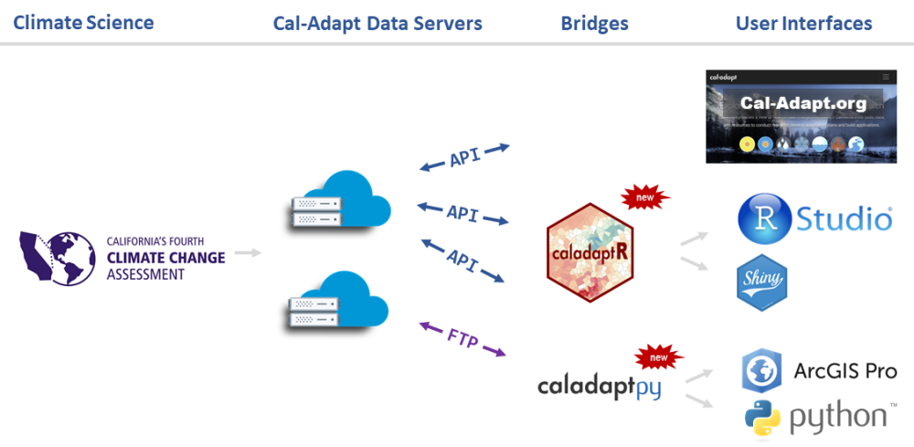
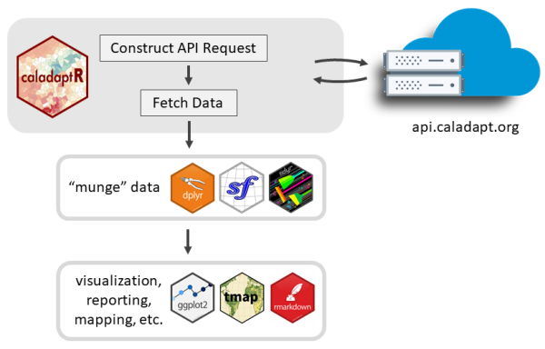

# Cal-Adapt

```{r setup, include = FALSE}
knitr::opts_chunk$set(echo = TRUE)
library(caladaptr)
library(DiagrammeR)  ## has a conflict with leaflet, must go high up in the pecking order
library(knitr)
library(kableExtra)
library(magrittr)
library(dplyr)
library(tidyr)
library(sf)
library(leaflet)
```

```{css echo = FALSE}
div.slide.titlepage h1 {
  padding-top:5%;
}

h1 {
  color:darkgreen;
}
h1.title {
  color:black;
  font-size:130%;
}
h2 {
  color:#444;
  font-size: 1.2em;
}
span.revlabel {
  border-radius:3px;
  font-size:60%;
  padding:2px 4px;
  margin-right:1em;
  background-color:MediumSeaGreen;
  color:white;
}
span.chk {
  color:DarkGreen;
}

.indented1 {
  margin-left:1em;
}
div.indented2 {
  margin-left:2em;
}
p.date {
  text-align:left;
}
table.borderme {
  border:2px solid #246ABF;
  border-collapse:collapse;
}

table.borderme td {
  border: 1px solid #eee;
}

table.shademe td {
  background:#eee;
  padding:8px;
}

div.li-single li {
  margin-bottom:0.1em;
} 
.test_delete {
  line-height:0.7em;
}
pre {
  font-weight:normal;
  font-size:80%;
}
```

<script type="text/javascript">w3c_slidy.mouse_click_enabled = false;</script>

```{r color, echo = FALSE, results='asis'}
# crayon needs to be explicitly activated in Rmd
options(crayon.enabled = TRUE)
# Hooks needs to be set to deal with outputs
old_hooks <- fansi::set_knit_hooks(knitr::knit_hooks, 
                                   which = c("output", "message", "error"))
```

Cal-Adapt is California's **official portal** for **peer-reviewed** climate data. 

Datasets are selected with guidance and priorities from California State agencies. 

Projected Climate Data:

<div style="width:400px; float:left; margin-left:3em;">
- temperature <span class="revlabel">6 km</span>  
- precipitation <span class="revlabel">6 km</span>  
- snow water equivalent <span class="revlabel">6 km</span>  
- relative humidity <span class="revlabel">6 km</span>  
- surface solar radiation <span class="revlabel">6 km</span>  
- wind speed
</div>

<div style="width:400px; float:left;">
- wildfire risk
- drought scenarios
- streamflow
- sea level rise
- other derived variables
</div>

<div style="clear:both;"></div>

<!---      --->

Extent of LOCA downscaled climate data layers:

```{r data_area, echo = FALSE, cache = TRUE, eval = TRUE}
loca_area_sf <- st_read(system.file("extdata", "loca_area.geojson", package = "caladaptr"), quiet = TRUE)
leaflet(loca_area_sf) %>% addTiles() %>% addPolygons()
```


\

   


# Cal-Adapt Data



# Options for Accessing Cal-Adapt Data

```{r getting_data_options, echo=FALSE, results='asis', cache=FALSE}
tbl_vec <- c("Feature", "Cal-Adapt website", "Cal-Adapt FTP", "caladaptPy",
             "caladaptR",
             
             "Download rasters", "", "", "", "",
             "Statewide", "<span class='chk'>&#10004;</span>", "<span class='chk'>&#10004;</span>", "<span class='chk'>&#10004;</span>", "",
             "User area-of-interest", "<span class='chk'>&#10004;</span>", "", "planned", "<span class='chk'>&#10004;</span>",
             "10 recommended GCMs", "<span class='chk'>&#10004;</span>", "<span class='chk'>&#10004;</span>", "<span class='chk'>&#10004;</span>", "<span class='chk'>&#10004;</span>",
             "All 32 GCMs", "", "<span class='chk'>&#10004;</span>", "<span class='chk'>&#10004;</span>", "",
             
             "Query features", "", "", "", "",
             "Points (user-provided)", "<span class='chk'>&#10004;</span>", "", "<span class='chk'>&#10004;</span>", "<span class='chk'>&#10004;</span>",
             "Lines (user-provided)", "<span class='chk'>&#10004;</span>", "", "<span class='chk'>&#10004;</span>", "",
             "Polygons (user-provided)", "<span class='chk'>&#10004;</span>", "", "<span class='chk'>&#10004;</span>", "<span class='chk'>&#10004;</span>",
             "Polygons (presets, boundary layers)", "<span class='chk'>&#10004;</span>", "", "", "<span class='chk'>&#10004;</span>",
             
             "Other", "", "", "", "",
             "Extract underlying tables from preset charts", "<span class='chk'>&#10004;</span>", "", "", "")

tbl_mat <- matrix(tbl_vec, byrow=TRUE, ncol=5)

knitr::kable(tbl_mat, format = "html", align = c("l", "c", "c", "c", "c"), 
             table.attr="class='borderme'", escape = FALSE) %>% 
  column_spec(1, width = "15em") %>%
  row_spec(1, bold=TRUE, background = gray(0.80), color = "black", align = "c", extra_css = "padding:0.5em 1em;") %>%
  row_spec(c(2,7,12), bold=TRUE, background = gray(0.9), italic = TRUE) %>% 
  kable_styling(full_width = FALSE)

```

\

More info:

<div class="indented2">
- [*Accessing Climate Data through Cal-Adapt*](https://cal-adapt.org/blog/2019/webinar-june-2019){target="_blank" rel="noopener"}, Cal-Adapt Quarterly Webinar, June 2019
</div>

# caladaptR



## Key Features

<div class = "indented2 li-single">

- `caladaptr` is an **API client** package  
- main job is to provide low-level functions for **querying** and **importing** Cal-Adapt data via the API  
- uses modern R programming standards:  

<div class = "indented1">
- pipe friendly functions  
- accepts and returns standard data classes (e.g., tibble, sf, raster)
- units encoded in the results
- follows development guidelines from [rOpenSci](https://devguide.ropensci.org/){target="_blank"}  
</div>

</div>

\

## Main Uses 

<div class = "indented2 li-single">
- Retrieve values from *any* Cal-Adapt raster series  
- Query with **user-provided** points, lines, and polygons  
- Query built-in **preset** areas-of-interest  
- Download climate variables as **data frames** (tibbles) or **rasters** (stars)
</div>

\

## Prerequisites

The user is expected to know:

<div class = "indented2 li-single">
- how to **work with data** in R  
- what **data** you're looking for   
- how to use climate projections **wisely**  
</div>

# caladaptR workflow

In general, there are **five** steps to using caladaptR:

```{r workflow, echo = FALSE, cache = TRUE}
library(DiagrammeR)
grViz("digraph flowchart {
  node [fontname = Helvetica, shape = rectangle]
  tab1 [label = '@@1']
  tab2 [label = '@@2']
  tab3 [label = '@@3']
  tab4 [label = '@@4']
  tab5 [label = '@@5']

  # edge definitions with the node IDs
  tab1 -> tab2 -> tab3 -> tab4 -> tab5;
  }

  [1]: '1) Determine your location(s) of interest,\\nassemble the required spatial objects\\n\\npreset area-of-interest, points, polygon)'
  [2]: '2) Create an API Request object'
  [3]: '3) Feed the API Request into a function that fetches data'
  [4]: '4) Munge the results into the format you require\\n\\n(e.g., filtering, sorting, joining, reshaping,\\nadd calculated columns, etc.)'
  [5]: '5) Continue on with your analysis or visualization'")
```

# Quick Example

1. Load the package:

```{r load_package, cache = FALSE}
library(caladaptr)
```

2. Create an API request object:

```{r cap1_make, cache = TRUE}
cap1 <- ca_loc_pt(coords = c(-121.4687, 38.5938)) %>%  ## specify a location
  ca_cvar(c("tasmax", "tasmin")) %>%                   ## climate variables
  ca_gcm(gcms[1:4]) %>%                                ## GCM(s)
  ca_scenario(scenarios[1:2]) %>%                      ## emission scenarios(s)
  ca_period("year") %>%                                ## temporal aggregation period
  ca_years(start = 2040, end = 2060)                   ## start and end dates
```

3. Check API request 

```{r}
cap1

cap1 %>% ca_preflight()

plot(cap1, locagrid = TRUE)
```

4. Fetch data:

```{r cap1_fetch, cache = TRUE}
cap1_tbl <- ca_getvals_tbl(cap1, quiet = TRUE)
```

5. View the results

```{r}
cap1_tbl %>% slice(1:10)
```

# Need Big Data?

No problem!

```{r cap1_db, eval = FALSE}
cap1_db <- cap1 %>% 
  ca_getvals_db(db_fn = "c:/data/mydata.sqlite", db_tbl = "temp_min_max")
```

<div style="margin-left:1em;">
- downloaded values will be saved into SQLite database as you go  
- slow connection? No problem - it will chug away on its own   
- disconnected? No problem - it will pick up where it left off     
- additional caladaptR functions help you view contents of the SQLite database, manage indices, etc.  
- can use standard dplyr style functions thanks to:

<a href="https://dbplyr.tidyverse.org/" target="_blank" rel="noopener"><br/>https://dbplyr.tidyverse.org/</a>
</div>

# Need Rasters?

No problem!

```{r cap1_rst, eval = FALSE}
cap1_tifs <- cap1 %>% 
  ca_getrst_stars(out_dir = "c:/data/tifs")
```

<div style="margin-left:1em;">
- maximum size: county (San Bernardino County)     
- climate variables are downloaded as TIFs  
- an additional sidecar file saves the temporal details  
- read TIFs back into R with `ca_read_stars()`   

</div>

\

<a href="https://r-spatial.github.io/stars/" target="_blank" rel="noopener"><br/>https://r-spatial.github.io/stars/</a>

# Shiny Apps

<div style="display:inline-block; border:none; width:100px; line-height:90px; vertical-align:middle;"></div>
<div style="display:inline-block; border:none; vertical-align:middle; line-height:90px;">&rarr; browser based GUIs</div>

See samples:

<div style="margin-left:2em;">

- caladaptR [website](https://ucanr-igis.github.io/caladaptr/)  
- [caladaptr.apps](https://github.com/ucanr-igis/caladaptr.apps/) package  

<div style="margin:0 2em;">
```{r apps, eval = FALSE}
## Install caladaptr.apps and all dependent packages
remotes::install_github("ucanr-igis/caladaptr.apps")
library(caladaptr.apps)

## Launch the time series app
ca_launch("timeseries")

## Launch the projected chill portions app
ca_launch("chill")
```
</div>

- Online: [Projected Chill Portions](https://ucanr-igis.shinyapps.io/chill2/)
</div>

# Learning More

Website: <https://ucanr-igis.github.io/caladaptr/>

<div style="width:320px; float:left;">

**Resources**

<div class="indented1">
 - documentation  
 - getting started guide  
 - R notebooks  
 - presentations  
 </div>

</div>

<div style="width:400px; float:left;">

**Get Involved**

<div class="indented1">
- join [email list](https://lists.ucdavis.edu/sympa/subscribe/caladaptr){target="_blank" rel="noopener"}  
- submit feature requests and bug reports via [GitHub Issues](https://github.com/ucanr-igis/caladaptr/issues){target="_blank" rel="noopener"}  
- share ideas for code recipes and Shiny apps  
</div>
</div>

<div style="clear:both;"></div>

<div style="display:inline-block; width:720px; text-align:center;">
<br/>
Andy Lyons<br/><andlyons@ucanr.edu>
</div>


