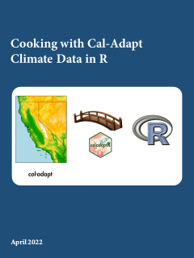
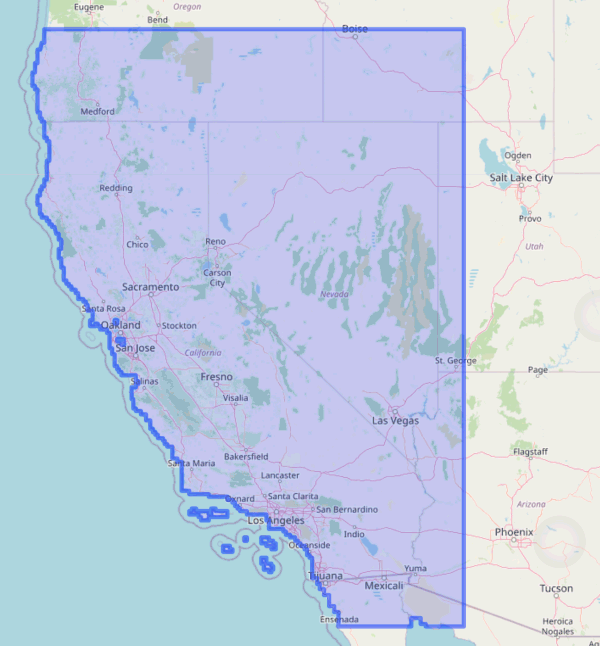
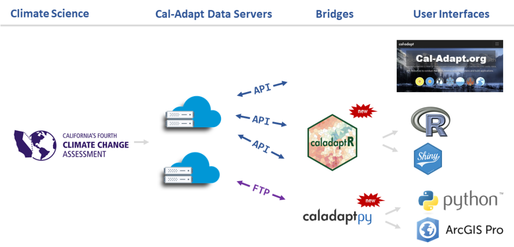

# About Me...

```{r setup, include = FALSE}
knitr::opts_chunk$set(echo = TRUE)
library(caladaptr)
library(DiagrammeR)  ## has a conflict with leaflet, must go high up in the pecking order
library(DiagrammeRsvg)
library(knitr)
library(kableExtra)
library(magrittr)
library(dplyr)
library(tidyr)
library(sf)
library(leaflet)
library(tmap)
library(htmltools)
library(ggplot2)
library(units)
source("gv2svg.R", local = knitr::knit_global())
```

```{js echo = FALSE}
w3c_slidy.mouse_click_enabled = false;
```


# Thanks also to ...

<div class = "indented2 li-single">
- Brian Galey  
- Lucy Andrews 
- Eric Lehmer
- Shruti Mukhtyar
- Nancy Thomas  
- Shane Feirer  
- Maggi Kelly  
</div>

\

<center>

{style="height:118px; margin-left:3em;"}
{style="height:118px; margin-left:3em;"}
{style="height:118px; margin-left:3em;"}

</center>

# Outcomes

**1\) Get familiar with caladaptR**

**2\) Hands-on practice with:**

<div style="margin-left:2em;">
a\) importing Cal-Adapt into R via the API  
b\) best practices for working with climate data  
c\) data wrangling for visualization or analysis   
d\) working with climate data as rasters  
</div>

**3\) Working Code Recipes**

<div style="margin-left:1em;">
a\) R Notebooks
</div>

<div style="margin-left:2em;">
<a href="https://ucanr-igis.github.io/ca_cookbook/" target="_blank"></a>

</div>

\

<div style="text-align:center; width:400px; margin-left:100px; border-bottom:2px solid black;">
&#43; foundational concepts  
&#43; code recipes  
&#43; working examples  
&#43; practice  
</div>
<div style="text-align:center; width:400px; margin-left:100px;">
**functional pRoficiency!**
</div>

# Cal-Adapt

Cal-Adapt is California's **official portal** for **peer-reviewed** climate data. 

Datasets are selected with guidance and priorities from California State agencies. 

## Modeled Climate Data

<div style="width:400px; float:left; margin-left:3em;">
- temperature <span class="revlabel">6 km</span>  
- precipitation <span class="revlabel">6 km</span>  
- snow water equivalent <span class="revlabel">6 km</span>  
- relative humidity <span class="revlabel">6 km</span>  
- surface solar radiation <span class="revlabel">6 km</span>  
- wind speed
</div>

<div style="width:400px; float:left;">
- wildfire risk
- drought scenarios
- streamflow
- sea level rise
- other derived variables
</div>

<div style="clear:both;"></div>

\

## Interpolated Observed Climate Data

<div style="margin-left:3em;">
- Livneh data (1950-2013) <span class="revlabel">6 km</span>  
- gridMet (1979-2020) <span class="revlabel">4 km</span>  
</div>

\

## Spatial Extent

Spatial extent of LOCA downscaled climate data layers:



\

See also: [*What climate data does Cal-Adapt provide?*](https://cal-adapt.org/help/get-started/climate-data-and-other-data-on-caladapt/){target="_blank" rel="noopener"}

# Climate Data

```{r show_build, echo = FALSE, results = "asis", eval = FALSE}
img_fns <- paste0("./images/climate_data (", 1:5, ").png")
htmltools::HTML("<div style='position:relative; border:none;'>")
for (img_fn in img_fns) {
  print(htmltools::img(src = img_fn, class="incremental stackme"))
}
htmltools::HTML("</div>")
```

```{r data_builds, echo = FALSE, results = "asis"}
img_fns <- paste0("./images/climate_data (", 1:5, ").png")
htmltools::tagList(wrkshputils::wu_img_build(img_fns, display_first = TRUE, center = FALSE))
```

# Cal-Adapt Data



# Accessing Cal-Adapt Data

```{r getting_data_options, echo=FALSE, results='asis', cache=FALSE}
tbl_vec <- c("Feature", "Cal-Adapt website", "Cal-Adapt FTP", "caladapt-py",
             "caladaptR",
             
             "Download rasters", "", "", "", "",
             "Statewide", "<span class='chk'>&#10004;</span>", "<span class='chk'>&#10004;</span>", "<span class='chk'>&#10004;</span>", "<span class='chk'>&#10004;</span>",
             "User area-of-interest", "<span class='chk'>&#10004;</span>", "", "<span class='chk'>&#10004;</span>", "<span class='chk'>&#10004;</span>",
             "10 recommended GCMs", "<span class='chk'>&#10004;</span>", "<span class='chk'>&#10004;</span>", "<span class='chk'>&#10004;</span>", "<span class='chk'>&#10004;</span>",
             "All 32 GCMs", "", "<span class='chk'>&#10004;</span>", "<span class='chk'>&#10004;</span>", "",
             
             "Query features", "", "", "", "",
             "Points (user-provided)", "<span class='chk'>&#10004;</span>", "", "<span class='chk'>&#10004;</span>", "<span class='chk'>&#10004;</span>",
             "Lines (user-provided)", "<span class='chk'>&#10004;</span>", "", "<span class='chk'>&#10004;</span>", "",
             "Polygons (user-provided)", "<span class='chk'>&#10004;</span>", "", "<span class='chk'>&#10004;</span>", "<span class='chk'>&#10004;</span>",
             "Polygons (presets, boundary layers)", "<span class='chk'>&#10004;</span>", "", "", "<span class='chk'>&#10004;</span>",
             
             "Other", "", "", "", "",
             "Extract underlying tables from preset charts", "<span class='chk'>&#10004;</span>", "", "", "")

tbl_mat <- matrix(tbl_vec, byrow=TRUE, ncol=5)

knitr::kable(tbl_mat, format = "html", align = c("l", "c", "c", "c", "c"), 
             table.attr="class='borderme'", escape = FALSE) %>% 
  column_spec(1, width = "15em") %>%
  row_spec(1, bold=TRUE, background = gray(0.80), color = "black", align = "c", extra_css = "padding:0.5em 1em;") %>%
  row_spec(c(2,7,12), bold=TRUE, background = gray(0.9), italic = TRUE) %>% 
  kable_styling(full_width = FALSE)

```

\

More info:

<div class="indented2">
- [*Accessing Climate Data through Cal-Adapt*](https://www.youtube.com/watch?v=9ox8GPasI9M){target="_blank" rel="noopener"}, Cal-Adapt Quarterly Webinar, June 2019 {style='height:30px;'}

</div>

# Why you might want to work with Cal-Adapt data in R

<div style="width:45%; float:left;">

## Convert statements about climate into actionable info:

<div class="indented2">

*The rolling average of maximum daily temperature  will increase by X*

*Species A, B, & C are most likely to survive in the projected climate envelope.*

</div>

## Custom visualizations 

## Integrate results with other data
 
 <div class="indented2 li-single">
 - census data  
 - biodiversity / habitat  
 - economic data
 </div>
 
## Take advantage of other R packages

## Make your own custom models

## Make a decision support tool

<a href="https://ucanr-igis.shinyapps.io/chill/" target="_blank" rel="noopener"></a>

</div>

<div style="width:45%; float:left;">

</div>

<div style="clear:both;"></div>


# caladaptR


## Key Features

<div class = "indented2 li-single">

- `caladaptr` is an **API client** package  
- main job is to provide low-level functions for **querying** and **importing** Cal-Adapt data via the API  
- uses modern R programming conventions:  

<div class = "indented1">
- pipe friendly functions  
- accepts and returns standard data classes (e.g., tibble, sf, stars)
- units encoded in the results
</div>

</div>

\

## Main Uses 

<div class = "indented2 li-single">
- Retrieve values from *any* Cal-Adapt raster series  
- Query with **user-provided** points and polygons  
- Query built-in **preset** areas-of-interest  
- Download climate variables as **tibbles** (data frames) or **rasters** (tiffs & stars)
</div>

\

## Prerequisites

caladaptR users need to know:

<div class = "indented2 li-single">
- how to **work with data** in R  
- what **data** you're looking for   
- how to use climate projections **wisely**  
</div>

\

## Learning caladaptR

Start here: <https://ucanr-igis.github.io/caladaptr/>

<div class="indented2 li-single">
- articles (tutorials and technical guides) 
- function documentation  
- R notebooks  
- presentations  
- [*Cooking with Cal-Adapt Climate Data in R*](https://ucanr-igis.github.io/ca_cookbook/){target="_blank" rel="noopener"} eBook
</div>

# caladaptR workflow

In general, there are **five** steps to using caladaptR:

```{r workflow_svg, echo = FALSE, cache = TRUE}
workflow_gv <- grViz("digraph flowchart {
  node [fontname = Helvetica, shape = rectangle]
  tab1 [label = '@@1']
  tab2 [label = '@@2']
  tab3 [label = '@@3']
  tab4 [label = '@@4']
  tab5 [label = '@@5']

  # edge definitions with the node IDs
  tab1 -> tab2 -> tab3 -> tab4 -> tab5;
  }

  [1]: '1) Determine your location(s) of interest.\\nYou can use your own points or polygons,\\nor one of the preset areas-of-interest'
  [2]: '2) Create an API Request object'
  [3]: '3) Feed the API Request into a function that fetches data'
  [4]: '4) Wrangle the results into the format you require\\n(e.g., filtering, sorting, joining, reshaping,\\nadd calculated columns, etc.)'
  [5]: '5) Continue on with your analysis or visualization'")

workflow_html <- workflow_gv %>% gv2svg(width = 520) 

htmltools::HTML(workflow_html)
```

# Building an API Request

```
cap1 <- ca_loc_pt(coords = c(-121.4687, 38.5938)) %>%  
  ca_cvar(c("tasmax", "tasmin")) %>%                   
  ca_gcm(gcms[1:4]) %>%                                
  ca_scenario(scenarios[1:2]) %>%                      
  ca_period("year") %>%                                
  ca_years(start = 2040, end = 2060)                   
```

An API Request object consists of between 2 and 4 components:

\

**1. Location** (*required, pick one*)

```{r api_constructors_loc, echo=FALSE, results='asis', cache=TRUE}
col1_width <- "12em"

tbl_vec <- c("ca_loc_aoipreset()", "Query a preset location(s)",
             "ca_loc_pt()", "Question point location(s)",
             "ca_loc_sf()", "Query simple feature location(s)")

kable(matrix(tbl_vec, byrow=TRUE, ncol=2), 
      format = "html", align = c("l", "l"), table.attr="class='shademe'") %>% 
  column_spec(column = 1, monospace = TRUE, width = col1_width) %>%
  kable_styling(full_width = FALSE, position = "left")
```

\

**2. Raster series dataset**

<div class="indented1">

**Option 1**: Choose downscaled climate projection(s) from Scripps using **all 4** of the following constructor functions:

```{r api_const_loca, echo=FALSE, results='asis', cache=FALSE}
library(magrittr); library(kableExtra)

tbl_vec <- c("ca_cvar()", "Select the climate variable(s) (i.e., precip, temperature)",
             "ca_gcm()", "Pick or more of the 10 Global Climate Models",
             "ca_period()", "Select temporal aggregation period (year, month, day)",
             "ca_scenario()", "Choose your emission scenario(s)")

knitr::kable(matrix(tbl_vec, byrow=TRUE, ncol=2), 
      format = "html", align = c("l", "l"), table.attr="class='shademe'") %>% 
  kableExtra::column_spec(column = 1, monospace = TRUE, width = col1_width) %>% 
  kableExtra::kable_styling(full_width = FALSE, position = "left")
```

\

**Option 2**: Choose a Livneh dataset using **all 3** of the following constructor functions:

```{r api_const_livneh, echo=FALSE, results='asis', cache=FALSE}
library(magrittr); library(kableExtra)

tbl_vec <- c("ca_cvar()", "Select the climate variable(s) (i.e., precip, temperature)",
             "ca_livneh", "TRUE",
             "ca_period()", "Select temporal aggregation period (year, month, day)")

knitr::kable(matrix(tbl_vec, byrow=TRUE, ncol=2), 
      format = "html", align = c("l", "l"), table.attr="class='shademe'") %>% 
  kableExtra::column_spec(column = 1, monospace = TRUE, width = col1_width) %>% 
  kableExtra::kable_styling(full_width = FALSE, position = "left")
```

\

**Option 3**: Pick *any* of the 935 raster series datasets by their '**slug**':

```{r api_const_slug, echo=FALSE, results='asis', cache=FALSE}
tbl_vec <- c("ca_slug()", "Select a dataset by its slug")
knitr::kable(matrix(tbl_vec, byrow=TRUE, ncol=2), 
      format = "html", align = c("l", "l"), table.attr="class='shademe'") %>% 
  kableExtra::column_spec(column = 1, monospace = TRUE, width = col1_width) %>% 
  kableExtra::kable_styling(full_width = FALSE, position = "left")
```

</div>

\

**3. Start & end dates** (*optional, pick one*)

```{r api_const_start_end, echo=FALSE, results='asis', cache=FALSE}
library(magrittr)
tbl_vec <- c("ca_years()", "Specify start & end by **year**",
             "ca_dates()", "Specify start & end by **date**")
knitr::kable(matrix(tbl_vec, byrow=TRUE, ncol=2), 
      format = "html", align = c("l", "l"), table.attr="class='shademe'") %>% 
  kableExtra::column_spec(column = 1, monospace = TRUE, width = col1_width) %>% 
  kableExtra::kable_styling(full_width = FALSE, position = "left")
```

\

**4. Options** (*required for polygons*)

```{r api_options, echo=FALSE, results='asis', cache=FALSE}
library(magrittr)
tbl_vec <- c("ca_options()", "Spatial aggregation function(s)")
knitr::kable(matrix(tbl_vec, byrow=TRUE, ncol=2), 
      format = "html", align = c("l", "l"), table.attr="class='shademe'") %>% 
  kableExtra::column_spec(column = 1, monospace = TRUE, width = col1_width) %>% 
  kableExtra::kable_styling(full_width = FALSE, position = "left")
```

# Quick Example

1. Load the package:

```{r load_package, cache = FALSE}
library(caladaptr)
```

2. Create an API request object:

```{r sdzoo_cap, cache = TRUE}
sdzoo_cap <- ca_loc_pt(coords = c(-117.0, 33.1)) %>%  ## specify a location
  ca_cvar(c("tasmax", "tasmin")) %>%                  ## climate variables
  ca_gcm(gcms[1:4]) %>%                               ## GCM(s)
  ca_scenario(scenarios[1:2]) %>%                     ## emission scenarios(s)
  ca_period("year") %>%                               ## temporal aggregation period
  ca_years(start = 2040, end = 2060)                  ## start and end dates
```

3. Check API request 

```{r sdzoo_cap_check, cache = FALSE}
sdzoo_cap

sdzoo_cap %>% ca_preflight()

plot(sdzoo_cap, locagrid = TRUE)
```

4. Fetch data:

```{r sdzoo_tbl, cache = TRUE}
sdzoo_tbl <- sdzoo_cap %>% ca_getvals_tbl(quiet = TRUE)
```

5. View the results

```{r sdzoo_tbl_slice, cache = TRUE}
sdzoo_tbl %>% slice(1:10)
```

# Preset Areas-of-Interest

The Cal-Adapt API server has 11 preset **areas of interest** (aka boundary layers).

<div class="li-single" style="float:left; width=450px; margin-left:2em;">
- Census Tracts
- Counties
- Congressional Districts
- Climatic Regions
- Watersheds
- Irrigated Water Management Districts
</div>

<div class="li-single" style="float:left; width=450px;">
- 4th Climate Change Assessment Regions
- Electrical Utilities
- WECC Load Areas
- Event Locations
- Places  
</div>

<div style="clear:both;"></div>

You can query these features **without passing a spatial object**!

Example:

```{r cap2, cache=FALSE}
norcal_cap <- ca_loc_aoipreset(type = "counties", 
                         idfld = "fips", 
                         idval = c("06105", "06049", "06089", "06015")) %>% 
  ca_gcm(gcms[1:4]) %>%
  ca_scenario(scenarios[1:2]) %>%
  ca_period("year") %>%
  ca_years(start = 2040, end = 2060) %>%
  ca_cvar("pr") %>% 
  ca_options(spatial_ag = "max")
```

Plot an API request to verify the location:

```{r plot_cap2, message = FALSE, warning = FALSE, cache=FALSE}
plot(norcal_cap)
```

# User-Defined Geometries

An API request can use a simple feature data frame as the query location (point, polygon, and multipolygon).

Use `sf::st_read()` to import Shapefiles, geojson, KML, geopackage, ESRI geodatabases, etc.

```{r pincls_import}
library(sf)
pinnacles_bnd_sf <- st_read("./notebooks/data/pinnacles_bnd.geojson")
pinnacles_bnd_sf
```

Crate an API request:

```{r pincls_cap, cache=FALSE}
pin_cap <- ca_loc_sf(loc = pinnacles_bnd_sf, idfld = "UNIT_CODE") %>% 
  ca_slug("et_month_MIROC5_rcp45") %>%
  ca_years(start = 2040, end = 2060) %>% 
  ca_options(spatial_ag = "mean")

plot(pin_cap, locagrid = TRUE)
```

Fetch data:

```{r cache = TRUE}
pin_tbl <- pin_cap %>% ca_getvals_tbl()
head(pin_tbl)
```

# Notebook Time!

R Notebooks are written in “R Markdown”, which combines text and R code.

```{r show_build_rnb, echo = FALSE, results = "asis"}
img_fns <- paste0("./images/rnotebooks (", 1:9, ").png")
htmltools::tagList(wrkshputils::wu_img_build(img_fns, display_first = TRUE))
```

<div class="shaded-box" style="width:800px;">
**Tips**

Every time you hit saves, it generates a HTML file in the background.

Remember when you’re in a R Notebook, the working directory is *where the Rmd file resides*.

Common error:  
<span style="color:crimson; font-size:80%; font-family:monospace;">Error creating notebook: path for html_dependency. Path not found: /tmp/RtmpjR1sPw</span> 

<div class="indented2 li-single">
  
 - Knit button &rarr; Clear Knitr Cache, or  
 - Restart RStudio  
</div>
</div>


# Notebook 1. Getting Started

In Notebook 1, you will:

<div class="indented1 li-single">
- Create API requests for i) a point, and ii) a preset area-of-interest (county)  
- Wrangle data for plotting    
- Plot a time series
</div>

<div class="shaded-box" style="width:500px;">
**Getting Help**

<div class="indented2 li-single">
 - Chat window
 - Share screen
 - Breakout rooms  
</div>
</div>

[Notebook 1. Getting Started](./notebooks/nb01_getting-started.nb.html){target="_blank" rel="noopener"} | [solutions](./notebooks/nb01_getting-started_ans.nb.html){target="_blank" rel="noopener"}


# END!


