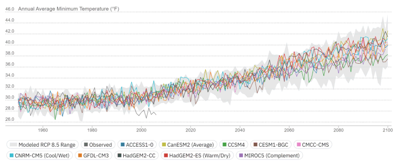
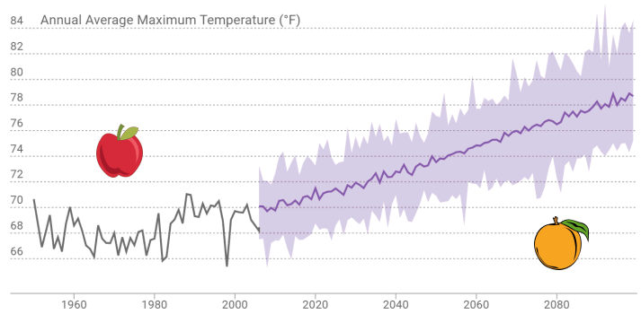
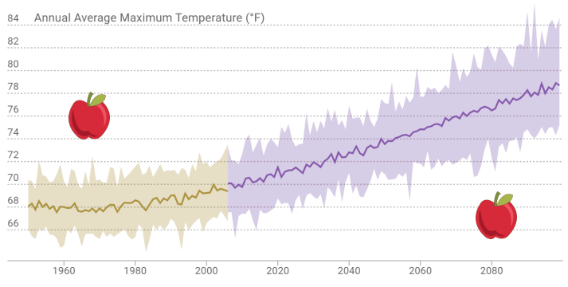

# Finding Data: Raster Series Catalog

```{r setup, include = FALSE}
knitr::opts_chunk$set(echo = TRUE)
library(caladaptr)
library(DiagrammeR)  ## has a conflict with leaflet, must go high up in the pecking order
library(knitr)
library(kableExtra)
library(magrittr)
library(dplyr)
library(tidyr)
library(sf)
library(leaflet)
library(tmap)
library(htmltools)
library(ggplot2)
library(units)
```

```{js echo = FALSE}
w3c_slidy.mouse_click_enabled = false;
```

caladaptR comes with a copy of the Cal-Adapt raster series "data catalog"

For each raster series you can see the:

<div class = "indented1 li-single">
- full name  
- slug (unique identifier)  
- begin and end date  
- temporal resolution  
- units  
- spatial extent  
- number of rasters  
</div>

The catalog can be retrieved using `ca_catalog_rs()` (returns a tibble). 

<div class="indented2 indented2r">
```{r ca_catalog_rs_head}
ca_catalog_rs() %>% head()
```
</div>

\

<div class="shaded-box">
**PRO TIP**

The best way to browse the catalog is with RStudio's View pane. You can then use the filter buttons to find the raster series you want. 

```
ca_catalog_rs() %>% View()
```

</div>

\

To search the catalog using a keyword, you can use `ca_catalog_rs()`

<div class="indented2 indented2r">
```{r ca_catalog_search_snow}
all_snow_layers_df <- ca_catalog_search("snow", quiet = TRUE)

str(all_snow_layers_df)
```
</div>

\

To see the properties of a specific dataset (e.g., to see the dates, or units), you can search on the slug:

<div class="indented2 indented2r">
```{r ca_catalog_search_livneh}
ca_catalog_search("snowfall_day_livneh_vic")
```
</div>

\

# Using Climate Data *Wisely*

Is this a wise or unwise use of climate data?

<div style="text-align:center; font-size:110%; line-height:110%; margin:1em auto; max-width:900px;">*According to Cal-Adapt, which weekend in February 2070 has the least chance of rain for my retirement party at the San Luis Obispo Country Club?*</div>

<center>
```{r slo_rain, cache=TRUE, echo=FALSE, message = FALSE, results = 'hold', fig.show='hold'}
library(caladaptr)
library(dplyr)
library(ggplot2)
library(units)

slo_cap <- ca_loc_pt(coords = c(-120.6276, 35.2130)) %>%
  ca_cvar("pr") %>%
  ca_gcm(gcms[1:10]) %>%
  ca_scenario("rcp45") %>%
  ca_period("day") %>%
  ca_dates(start = "2070-02-01", end = "2070-02-28")

slo_mmday_tbl <- slo_cap %>% 
  ca_getvals_tbl(quiet = TRUE) %>% 
  mutate(pr_mmday = set_units(as.numeric(val) * 86400, mm/day))

feb2070_weekends_df <- data.frame(dt = as.Date("2070-02-01") + c(0,1,7,8,14,15,21,22), y = 50)

ggplot(data = slo_mmday_tbl, aes(x = as.Date(dt), y = as.numeric(pr_mmday))) +
  geom_col(data = feb2070_weekends_df, aes(x = dt, y = y), fill = "red", alpha = 0.2) +
  geom_point(aes(color=gcm)) + 
  labs(title = "Chance of Rain at the San Luis Obispo Country Club, February 2070", 
       subtitle = "Pink bars represent the weekends. Emissions scenario: RCP 4.5.",
       x = "date", y = "mm") +
  theme(plot.caption = element_text(hjust = 0),
        plot.background = element_rect(color = "gray", size = 1)) 
```

</center>

<details style="margin-left:2em; cursor: pointer;">
<summary style="color:#666; font-size:90%;">Make this plot</summary>
```
library(caladaptr)
library(dplyr)
library(ggplot2)
library(units)

slo_cap <- ca_loc_pt(coords = c(-120.6276, 35.2130)) %>%
  ca_cvar("pr") %>%
  ca_gcm(gcms[1:10]) %>%
  ca_scenario("rcp45") %>%
  ca_period("day") %>%
  ca_dates(start = "2070-02-01", end = "2070-02-28")

slo_mmday_tbl <- slo_cap %>% 
  ca_getvals_tbl(quiet = TRUE) %>% 
  mutate(pr_mmday = set_units(as.numeric(val) * 86400, mm/day))

feb2070_weekends_df <- data.frame(dt = as.Date("2070-02-01") + c(0,1,7,8,14,15,21,22), y = 50)

ggplot(data = slo_mmday_tbl, aes(x = as.Date(dt), y = as.numeric(pr_mmday))) +
  geom_col(data = feb2070_weekends_df, aes(x = dt, y = y), fill = "red", alpha = 0.2) +
  geom_point(aes(color=gcm)) + 
  labs(title = "Chance of Rain at the San Luis Obispo Country Club, February 2070", 
       subtitle = "Pink bars represent the weekends. Emissions scenario: RCP 4.5.",
       x = "date", y = "mm") +
  theme(plot.caption = element_text(hjust = 0)) 

```
</details>

\

# Best Practices Analyzing Modeled Climate Data

## 1\) Examine 20-30 Year Time Periods

<div class="indented2">
Climate models are designed to capture *trends* in *climate*.

By definition, climate is weather averaged over **30+ years**.

&#8658; If you're not averaging at least 20-30 years of data, you're probably doing something wrong.
</div>

\

## 2\) Look at multiple models & emissions scenarios

<div class="indented2">
There is variability among models.

The biggest source of uncertainty (by far) is the future of emissions.
</div>

\

## 3\) Look at both central tendency and the range of variability

<div class = "indented2">

Both are important. 

Variability can be within and/or between models.

</div>

{style="display:block; margin:1em auto; border:1px solid grey;"}

\

## 4\) Aggregate, aggregate, aggregate

<div class = "indented2 li-single">
- don't look at specific points in space or time  
- average years together  
- average models together  
- take rolling averages  
- interested in an area? spatially aggregate  
</div>

\

## 5\) Compare, compare, compare

<div class = "indented2 li-single">
- Compare projected future against historical conditions  
- Compare Place A vs Place B  
- Compare emission scenarios  
- Compare models
</div>

\

## 6\) Consider climate analogues

<div class = "indented2">
*Where can I go right now to see the climate that my city will face in 50 years?*
</div>

\

# Comparing the Past to the Future

What is the appropriate historic baseline for modeled future climate scenarios?

\

**Observed historic record and modeled future** - *different animals*

{border="1"}

\

**Model historic climate and modeled future** - *comparable*

{border="1"}

\

# The Dilemma of Multiple Futures

<div style="display: flex;">

<div style="width:580px; flex-grow:0;">
How do we make sense of multiple climate futures?

How do we store data for multiple futures?

What is the right order of operations for computing metrics, aggregating data, and doing comparisons?
</div>

<div style="width:370px;">

</div>

</div>

\

## Example: *How will heat spells in Madera County change under climate change compared to historic conditions?*

Source Data (example):  

<div class = "indented2 li-single">

 - daily maximum temperature   
 - 30 years  
 - 10 GCMs
 - 3 emissions scenarios (RCP 45, RCP85, historical)
 </div>
 
That's 365 * 30 * 10 * 3 = <strong>`r format(365 * 30 * 10 * 3, big.mark = ",")` values of tasmax</strong>, for *each* pixel in the county!

\

## General Order of Operations

```{r order_operations, echo=FALSE, results='asis', cache=TRUE}
tbl_vec <- c("Operation", "Example", "R functions",
             "1) filter by space", "Madera County, Census tracts, etc.", "build into API request",
             "2) filter by year", "2070-2099", "build into API request",
             "3) filter by month or season", "Sep - June", "`dplyr::filter()`",
             "4) group by time slices", "water year", "`dplyr::group_by()`",
             "5) compute daily metrics", "'extreme heat' day", "`dplyr::mutate()`",
             "6) tabluate 'runs'", "heat spell = extreme heat for at least 3 days", "`rle()`", 
             "7) aggregate by time slice", "total # heat spells per water year", "`dplyr::summarise()`",
             "8) aggregrate by GCM", "avg # heat spells per GCM", "`dplyr::summarise()`",
             "9) aggregate by scenario", "avg # heat spells per emissions scenario", "`dplyr::summarise()`",
             "10) compare", "compare across scenarios, locations", "")

tbl_mat <- matrix(tbl_vec, byrow=TRUE, ncol=3)

knitr::kable(tbl_mat, format = "html", align = c("l", "l"), 
             table.attr="class='borderme'", escape = FALSE) %>% 
  column_spec(1, width = "15em") %>%
  row_spec(1, bold=TRUE, background = gray(0.80), color = "black", align = "c", extra_css = "padding:0.5em 1em;") %>%
  kable_styling(full_width = TRUE)
```

# Data Wrangling

Cal-Adapt data always comes down in a "long" format:

<div class="indented2 indented2r">
```{r ca_loc_tbl, cache=TRUE}
ca_loc_pt(coords = c(-117.0, 33.1)) %>%
  ca_cvar(c("tasmax", "tasmin")) %>%
  ca_gcm(gcms[1:4]) %>%
  ca_scenario(scenarios[1:2]) %>%
  ca_period("year") %>%
  ca_years(start = 2040, end = 2060) %>% 
  ca_getvals_tbl(quiet = TRUE) %>% 
  head()
```
</div>

\

To make useful plots, maps, and summaries, you often have to 'munge' or 'wrangle' the data, which may include:

<div class = "indented2 li-single">
- selecting columns  
- filtering rows
- changing column data type  
- calculating new columns  
- grouping rows; summarizing  
- reshaping long to wide (aka pivoting)  
</div>

\

Fortunately you have a very robust toolbox:

<center><table><tr>

<td class="cp"><br/>
[[cheatsheet](https://raw.githubusercontent.com/rstudio/cheatsheets/main/data-transformation.pdf)]</td>

<td class="cp">{height="150"}<br/>
[[cheatsheet](https://raw.githubusercontent.com/rstudio/cheatsheets/main/tidyr.pdf)]</td>

<td class="cp">{height="150"}<br/>
[[cheatsheet](https://raw.githubusercontent.com/rstudio/cheatsheets/main/sf.pdf)]</td>

<td class="cp">{height="150"}<br/>
[[cheatsheet](https://raw.githubusercontent.com/rstudio/cheatsheets/main/data-visualization.pdf)]</td>

</tr></table></center>

\

## Top-Seven Data Wrangling Functions

<div class = "indented2 li-single" style="font-family:monospace;">
- filter()
- select()
- mutate()
- group_by()
- summarise()
- left_join()
- pivot_wider()
</div>

\

<div class="shaded-box">
**PRO TIP**

*Qtn.* How do I know what data wrangling is needed?

*Ans.* Work backward from your analysis or visualization functions.

</div>

\

# Notebook 2. Find and Wrangle Data

In Notebook 2, you will:

<div class="indented1 li-single">
- explore the Cal-Adapt data catalog  
- retrieve data using a slug  
- wrangle data for visualization and analysis  
- make histograms to visualize trends in variability  
</div>

[Notebook 2. Finding Data](./notebooks/nb02_find-wrangle.nb.html){target="_blank" rel="noopener"} | [solutions](./notebooks/nb02_find-wrangle_ans.nb.html){target="_blank" rel="noopener"}

# END!
