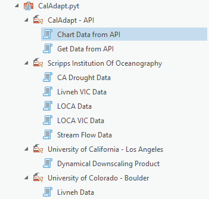

# About Me...

```{r setup, include = FALSE}
knitr::opts_chunk$set(echo = TRUE)
library(caladaptr)
library(DiagrammeR)  ## has a conflict with leaflet, must go high up in the pecking order
library(knitr)
library(kableExtra)
library(magrittr)
library(dplyr)
library(tidyr)
library(sf)
library(leaflet)
library(tmap)
```

```{css echo = FALSE}
div.slide.titlepage h1 {
  padding-top:5%;
}

h1 {
  color:darkgreen;
}
h1.title {
  color:black;
  font-size:130%;
}
h2 {
  color:#444;
  font-size: 1.2em;
}
span.revlabel {
  border-radius:3px;
  font-size:60%;
  padding:2px 4px;
  margin-right:1em;
  background-color:MediumSeaGreen;
  color:white;
}
span.chk {
  color:DarkGreen;
}

.indented1 {
  margin-left:1em;
}
div.indented2 {
  margin-left:2em;
}
p.date {
  text-align:left;
}
table.borderme {
  border:2px solid #246ABF;
  border-collapse:collapse;
}

table.borderme td {
  border: 1px solid #eee;
}

table.shademe td {
  background:#eee;
  padding:8px;
}

div.li-single li {
  margin-bottom:0.1em;
} 
.test_delete {
  line-height:0.7em;
}
pre {
  font-weight:normal;
  font-size:80%;
}
div.space_images > p > img {
  margin-bottom:4em;
}
div.code-sample {
  font-family: monospace;
  font-weight: normal;
  color:DarkOliveGreen;
  margin-left:0;
  margin-bottom:2em;
}
```


```{js echo = FALSE}
w3c_slidy.mouse_click_enabled = false;
```


# Thanks also to ...

<div class = "indented2 li-single">
- Brian Galey  
- Lucy Andrews 
- Eric Lehmer
- Shruti Mukhtyar
- Nancy Thomas  
- Shane Feirer  
- Maggi Kelly  
</div>

\

<center>

{style="height:118px; margin-left:3em;"}
{style="height:118px; margin-left:3em;"}
</center>

# About You

<div class="space_images">
```{r roster_plots, echo = FALSE}
source("~participant_profiles.R", local = knitr::knit_global())
ggplots_lst <- partipcant_plots(sheet_id = "1pOja8Rpz5y7Rfg65unGLrOUFlTZz94apL90RgKm7eEo",
                                fetch_roster = params$fetch_roster)

for (i in 1:length(ggplots_lst)) {
  print(ggplots_lst[[i]])
}
```
</div>


# Goals

**1\) Get familiar with caladaptR**

**2\) Hands-on practice with:**

a) importing Cal-Adapt into R via the API  
b) data wrangling techniques to prep data for visualization or analysis  
c) techniques for dealing with large volumes of data

**3\) More caladaptR users!**

a) use-cases for analyses and visualization  
b) ideas for code recipes, features, and documentation

\

## Learning Strategy

{style="margin-left:2em; border:1px solid grey;"}

\

<div style="text-align:center; width:400px; margin-left:100px; border-bottom:2px solid black;">
&#43; foundational concepts  
&#43; code recipes  
&#43; working examples  
&#43; practice  
</div>
<div style="text-align:center; width:400px; margin-left:100px;">
**functional pRoficiency!**
</div>

# Cal-Adapt

Cal-Adapt is California's **official portal** for **peer-reviewed** climate data. 

Datasets are selected with guidance and priorities from California State agencies. 

Modeled Climate Data:

<div style="width:400px; float:left; margin-left:3em;">
- temperature <span class="revlabel">6 km</span>  
- precipitation <span class="revlabel">6 km</span>  
- snow water equivalent <span class="revlabel">6 km</span>  
- relative humidity <span class="revlabel">6 km</span>  
- surface solar radiation <span class="revlabel">6 km</span>  
- wind speed
</div>

<div style="width:400px; float:left;">
- wildfire risk
- drought scenarios
- streamflow
- sea level rise
- other derived variables
</div>

<div style="clear:both;"></div>

See also: [*What climate data does Cal-Adapt provide?*](https://beta.cal-adapt.org/help/get-started/climate-data-and-other-data-on-caladapt/){target="_blank" rel="noopener"}.

Spatial extent of LOCA downscaled climate data layers:


\

   

# Cal-Adapt Data


# Options for Accessing Cal-Adapt Data

```{r getting_data_options, echo=FALSE, results='asis', cache=FALSE}
tbl_vec <- c("Feature", "Cal-Adapt website", "Cal-Adapt FTP", "caladapt-py",
             "caladaptR",
             
             "Download rasters", "", "", "", "",
             "Statewide", "<span class='chk'>&#10004;</span>", "<span class='chk'>&#10004;</span>", "<span class='chk'>&#10004;</span>", "<span class='chk'>&#10004;</span>",
             "User area-of-interest", "<span class='chk'>&#10004;</span>", "", "<span class='chk'>&#10004;</span>", "<span class='chk'>&#10004;</span>",
             "10 recommended GCMs", "<span class='chk'>&#10004;</span>", "<span class='chk'>&#10004;</span>", "<span class='chk'>&#10004;</span>", "<span class='chk'>&#10004;</span>",
             "All 32 GCMs", "", "<span class='chk'>&#10004;</span>", "<span class='chk'>&#10004;</span>", "",
             
             "Query features", "", "", "", "",
             "Points (user-provided)", "<span class='chk'>&#10004;</span>", "", "<span class='chk'>&#10004;</span>", "<span class='chk'>&#10004;</span>",
             "Lines (user-provided)", "<span class='chk'>&#10004;</span>", "", "<span class='chk'>&#10004;</span>", "",
             "Polygons (user-provided)", "<span class='chk'>&#10004;</span>", "", "<span class='chk'>&#10004;</span>", "<span class='chk'>&#10004;</span>",
             "Polygons (presets, boundary layers)", "<span class='chk'>&#10004;</span>", "", "", "<span class='chk'>&#10004;</span>",
             
             "Other", "", "", "", "",
             "Extract underlying tables from preset charts", "<span class='chk'>&#10004;</span>", "", "", "")

tbl_mat <- matrix(tbl_vec, byrow=TRUE, ncol=5)

knitr::kable(tbl_mat, format = "html", align = c("l", "c", "c", "c", "c"), 
             table.attr="class='borderme'", escape = FALSE) %>% 
  column_spec(1, width = "15em") %>%
  row_spec(1, bold=TRUE, background = gray(0.80), color = "black", align = "c", extra_css = "padding:0.5em 1em;") %>%
  row_spec(c(2,7,12), bold=TRUE, background = gray(0.9), italic = TRUE) %>% 
  kable_styling(full_width = FALSE)

```

More info:

<div class="indented2">
- [*Accessing Climate Data through Cal-Adapt*](https://cal-adapt.org/blog/2019/webinar-june-2019){target="_blank" rel="noopener"}, Cal-Adapt Quarterly Webinar, June 2019
</div>

# Why you might want to work with Cal-Adapt data in R

## Custom Visualization 
 
## Integrate results with other data
 
 <div class="indented2 li-single">
 - census data  
 - biodiversity / habitat  
 - economic data
 </div>
 
## Take advantage of other R packages

## Run custom models

## Research
 
## Custom decision support

# caladaptR


## Key Features

<div class = "indented2 li-single">

- `caladaptr` is an **API client** package  
- main job is to provide low-level functions for **querying** and **importing** Cal-Adapt data via the API  
- uses modern R programming standards:  

<div class = "indented1">
- pipe friendly functions  
- accepts and returns standard data classes (e.g., tibble, sf, stars)
- units encoded in the results
- follows development guidelines from [rOpenSci](https://devguide.ropensci.org/){target="_blank"}  
</div>

</div>

\

## Main Uses 

<div class = "indented2 li-single">
- Retrieve values from *any* Cal-Adapt raster series  
- Query with **user-provided** points and polygons  
- Query built-in **preset** areas-of-interest  
- Download climate variables as **tibbles** (data frames) or **rasters** (tiffs & stars)
</div>

\

## Prerequisites

caladaptR users need to know:

<div class = "indented2 li-single">
- how to **work with data** in R  
- what **data** you're looking for   
- how to use climate projections **wisely**  
</div>

# caladaptR workflow

In general, there are **five** steps to using caladaptR:

```{r workflow, echo = FALSE, cache = TRUE}
library(DiagrammeR)
grViz("digraph flowchart {
  node [fontname = Helvetica, shape = rectangle]
  tab1 [label = '@@1']
  tab2 [label = '@@2']
  tab3 [label = '@@3']
  tab4 [label = '@@4']
  tab5 [label = '@@5']

  # edge definitions with the node IDs
  tab1 -> tab2 -> tab3 -> tab4 -> tab5;
  }

  [1]: '1) Determine your location(s) of interest,\\nassemble the required spatial objects\\n\\npreset area-of-interest, points, polygons'
  [2]: '2) Create an API Request object'
  [3]: '3) Feed the API Request into a function that fetches data'
  [4]: '4) Munge the results into the format you require\\n\\n(e.g., filtering, sorting, joining, reshaping,\\nadd calculated columns, etc.)'
  [5]: '5) Continue on with your analysis or visualization'")
```

# Quick Example

1. Load the package:

```{r load_package, cache = FALSE}
library(caladaptr)
```

2. Create an API request object:

```{r cap1_make}
cap1 <- ca_loc_pt(coords = c(-121.4687, 38.5938)) %>%  ## specify a location
  ca_cvar(c("tasmax", "tasmin")) %>%                   ## climate variables
  ca_gcm(gcms[1:4]) %>%                                ## GCM(s)
  ca_scenario(scenarios[1:2]) %>%                      ## emission scenarios(s)
  ca_period("year") %>%                                ## temporal aggregation period
  ca_years(start = 2040, end = 2060)                   ## start and end dates
```

3. Check API request 

```{r}
cap1

cap1 %>% ca_preflight()

plot(cap1, locagrid = TRUE)
```

4. Fetch data:

```{r cap1_fetch}
cap1_tbl <- ca_getvals_tbl(cap1, quiet = TRUE)
```

5. View the results

```{r}
cap1_tbl %>% slice(1:10)
```

# Large Queries

<div class='code-sample'>
cap1_rtbl <- cap1 %>% **ca_getvals_db**(db_fn = "c:/data/mydata.sqlite", db_tbl = "temp_min_max")
</div>

<div style="margin-left:1em;">
- downloaded values will be saved into SQLite database as you go  
- slow connection? No problem - it will chug away on its own   
- disconnected? No problem - it will pick up where it left off     
- get back a remote tibble connected to the SQLite database  
- additional caladaptR functions help you view contents of the SQLite database, manage indices, etc.  
- standard dplyr verbs work thanks to <a href="https://dbplyr.tidyverse.org/" target="_blank" rel="noopener">dbplyr</a>
</div>

See also [*Large Queries*](https://ucanr-igis.github.io/caladaptr/articles/large-queries.html){target="_blank" rel="noopener"} vignette

# Rasters

<div class='code-sample'>
cap1_tifs <- cap1 %>% **ca_getrst_stars**(out_dir = "c:/data/tifs")
</div>

<div style="margin-left:1em;">
- downloaded climate data as TIFs 
- temporal details saved in sidecar file  
- read TIFs back into R with `ca_read_stars()`   
- combine multiple 3D TIFs into a single 6D stars object  
- large geoms: block &rarr; download TIFs &rarr; mosaic
- analyze with [stars](https://r-spatial.github.io/stars/){target="_blank" rel="noopener"}:
    - dplyr style filtering  
    - raster algebra  
    - custom pixel summaries  
    - spatial manipulations  
    - plotting
</div>

<center><a href="https://r-spatial.github.io/stars/" target="_blank" rel="noopener"></a></center>

See also [*Raster Vignettes*](https://ucanr-igis.github.io/caladaptr/articles/rasters-pt1.html){target="_blank" rel="noopener"}

# Shiny Apps

<div style="display:inline-block; border:none; width:100px; line-height:90px; vertical-align:middle;"></div>
<div style="display:inline-block; border:none; vertical-align:middle; line-height:90px; margin-bottom:2em;">&rarr; browser based GUIs</div>

Samples:

<div style="margin-left:2em;">

- caladaptR [website](https://ucanr-igis.github.io/caladaptr/)  
- [caladaptr.apps](https://github.com/ucanr-igis/caladaptr.apps/) package  

<div style="margin:0 2em;">
```{r apps, eval = FALSE}
## Install caladaptr.apps and all dependent packages
remotes::install_github("ucanr-igis/caladaptr.apps")
library(caladaptr.apps)

## Launch the time series app
ca_launch("timeseries")

## Launch the projected chill portions app
ca_launch("chill")
```
</div>

- Online: [Projected Chill Portions](https://ucanr-igis.shinyapps.io/chill2/)
</div>

---

{style='height:80px;'}

https://ucanr-igis.github.io/caladapt-py/

<div class="indented1 li-single">
- Jupytr Notebooks  
- ArcGIS Pro toolbox  
- workshop this fall 
</div>

\

<center> {style="margin-left:2em; height:333px;"}</center>


# Resources

## <https://ucanr-igis.github.io/caladaptr/>

<div class="indented1 li-single">
- documentation  
- Articles (tutorials and technical guides) 
- R notebooks  
- presentations  
</div>

\

## Works in progress...

<div class="indented1 li-single">
- code recipes  
- growing degree day R package  
- weather APIs  
- additional training material
- Shiny apps  
</div>

\

## Help wanted!

<div class="indented1 li-single">
- use-cases &#8658; code recipes and Shiny apps  
- beta testers  
- developers  
</div>

# R Notebooks

R Notebooks are written in “R Markdown”, which combines text and R code.


**Remember:**

When you’re in a R Notebook, the working directory is where the Rmd file resides.

