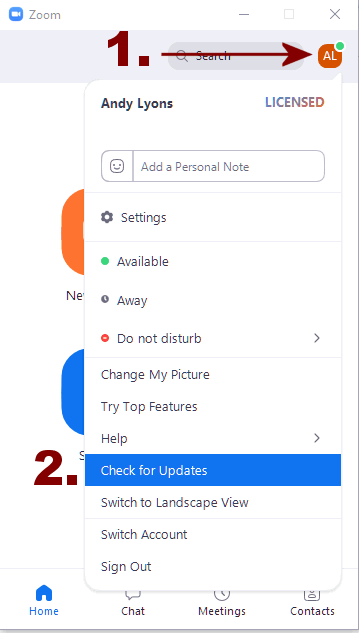
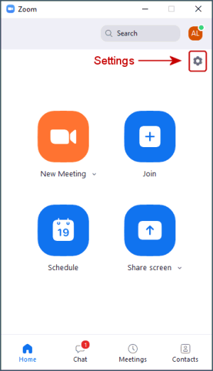
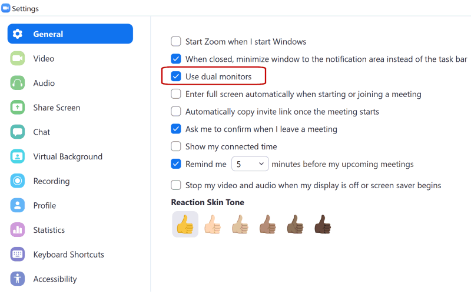
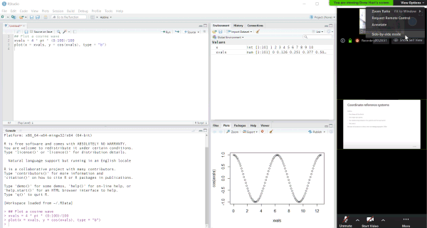

```{css echo = FALSE}
h1 {
  font-size: 18px;
  font-weight: bold;
  color:navy;
  margin-top:2em;
}
h1.title {
  font-size: 20px;
  font-weight: bold;
  color: #007020;
}
h2 {
  font-size: 16px;
  font-weight: bold;
  margin-top:2em;
}
h3 {
  font-size: 16px;
  font-weight: normal;
  font-style:italic;
  margin-top:2em;
}
p {
  font-family: 'Lucida Sans Unicode', 'Lucida Grande', sans-serif;
}
.workshop-title {
  font-size: 18px;
  font-weight: bold;
  color: black;
}

.indented1 {
  margin-left:1em;
}
ol {
  margin-left: 0px;
}
```

<div style="margin-bottom:3em;"></div>

# Setting Up Your Workspace 

Try to find a spot which is **comfortable** and **relatively free** from **distractions and background noise**. Some people find a pair of headphones helps minimize distractions. 

**Ergonomics** are important! If you've ever tried to work on a laptop while sitting on a couch for multiple hours, it isn't ideal! We will take at least one short bio-break each session. 

A **second screen** is extremely helpful, especially for hands-on workshops where you'll be working through a software exercise. With a second screen, you can view the instructor's slides or demo on one screen, and open RStudio on the other. 

<div style="width:660px; margin:2em auto; font-style:italic; font-size:120%; text-align:center;"><br/>
Connecting an external monitor to your computer is the best option for completing hands-on software workshops in Zoom</div>

# Zoom

This workshop will be taught entirely online using the Zoom platform. The instructor will send you the Zoom link via email and/or a calendar invite. 

Please make sure you have the [Zoom client](https://zoom.us/download){target="_blank" rel="noopener"} (app) installed. You can verify you have it installed if you see it in the Start Menu (Windows), or Finder (Mac). Please **make sure you have the latest version**, as some of the buttons and features have changed.

<p style="text-align:center; font-style:italic;"><br/>Check for updates on the Zoom app</p>

A **Zoom account** is *not* required. A **webcam** is *not* required. 

## Managing Zoom Audio

If you find your Zoom audio is garbled, perhaps due to poor bandwidth, you can **dial-in** with a phone. Click the microphone button on Zoom for details. In that case, you should disconnect from the the audio on your laptop or tablet (to prevent echo).

**Muting** and **unmuting** yourself are essential skills for Zoom. It's generally good practice to stay muted until you have something to say. If you're using the Zoom app on Windows, click the microphone button. If you're using the Zoom app for phones and tablets, tap the middle of the screen to make the controls visible. If you dial-in on a phone, you can use the 'mute' button on your phone app, or dial `*6` to mute or unmute yourself.

# Viewing RStudio and Zoom Simultaneously

## Dual Monitors (Best Option)

If you have an **external monitor** for your laptop / computer, you're all set. (Tip: turn on Zoom's *dual monitors* option, see below). Many TVs can be used as a second monitor depending on the video connections.

If you don't have a second monitor, a **tablet** may come in handy for viewing the slides / speaker. Zoom is available for all major tablets and phones.

Note however if you watch the slides on a tablet, you should **also** have Zoom running on your laptop so you can take the polls, click on links in the chat window, share your screen with the instructor, etc. In that scenario, you'll be logged into the Zoom meeting on two different devices, but only join the audio on one of the devices otherwise you may get a lot of echo!.

## Tips for Using Zoom on a Single Screen

### Tip 1. Turn on 'Dual Monitors'

The Zoom client for Windows has a 'Dual Monitors' option that will open up screen shares in a **separate window**. You don't actually need two monitors to use this option. This option is really useful on a single monitor, because you can move and resize the screen share window anywhere you'd like (and even 'pin' it to stay on top, see below).

To turn on Dual Monitors, click the gear icon (Settings) in the Zoom client, then check 'Dual Monitors'.

{style="display:block; margin:1em auto; border:1px solid grey;"}

{style="display:block; margin:1em auto; border:1px solid grey;"}

### Tip 2. Place Windows Side-by-Side

You can arrange your windows so that you see both RStudio and Zoom side-by-side (see below for example). You can devote the entire width of the Zoom window to the screen share by going to 'View Options' and making sure side-by-side mode is turned **off**.

A keyboard shortcut on Windows to move windows to the left or right is *windows key* + *left/right arrows*. You can then choose which of the remaining windows to put in the other half of the screen. By default, Windows will divide the screen into equal halves, but if you resize the width right after you use the shortcut, it will remember the setting. 

<a href="./images/rstudio-zoom_side-by-side_1920x1024x256.png" target="_blank"></a>

<p style="text-align:center; font-style:italic;">Arranging RStudio and Zoom side-by-side on a single monitor on Windows</p>

### Tip 3. Use a Utility to Keep the Zoom Window on Top

Surprisingly Zoom does not have an 'always on top' mode, but you can keep the Zoom client on top by using a 3rd party utility. Windows users can check out [DeskPins](https://efotinis.neocities.org/deskpins/index.html){target="_blank" rel="noopener"}, and Mac users can try [Rectangle](https://rectangleapp.com/){target="_blank" rel="noopener"}. 

<div class="indented2" style="border:2px solid lightgray; padding:10px;">

**Example: Deskpins**

In conjunction with Zoom's Dual Monitor options, DeskPins let you 'pin' Zoom's window with the presenter's screen share on top, so you can watch the presenter's demo while also working in your GIS program. Pinned windows can still be resized and moved around, so it doesn't get in the way of what you're working on. 

{style="display:block; margin:1em auto; border:1px solid grey;"}

To 'pin' a window, right-click on the DeskPins icon in the system tray, and select 'Enter Pin Mode'. To 'unpin' a window, simply click the little 'x' button that appears when you hover over the pushpin icon.

</div>

### Tip 4. Use Sticky Notes

If you like to take notes during Zoom meetings, a Sticky Notes utility can help. Almost all sticky notes programs have an option to stay on top, so you don't have to worry about your notes disappearing. Windows has a built-in 'Sticky Notes' app, but an even better one is [Stickies](https://www.zhornsoftware.co.uk/){target="_blank" rel="noopener"} from Zhorn Software.

## Sharing Your Screen

If needed, you can **share your RStudio window** with an instructor during an exercise to get help. Click the 'Share Screen' button on Zoom, and select your RStudio window. (Note: please don't share the entire screen to avoid accidentally sharing other windows!)

{style="display:block; margin:1em auto; border:1px solid gray;"}
\

