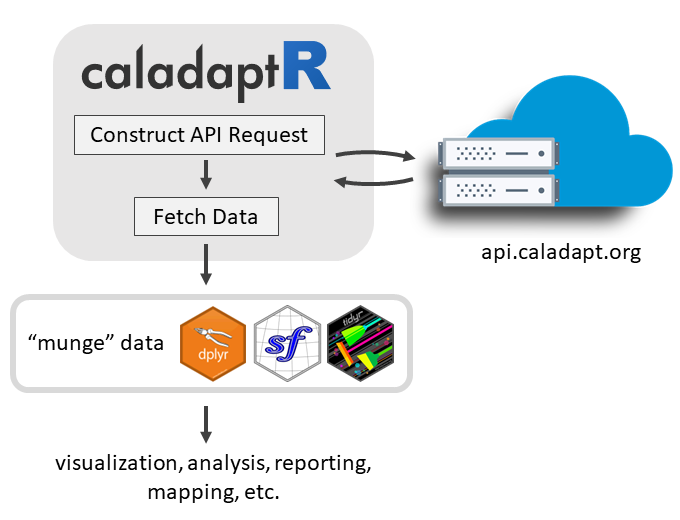
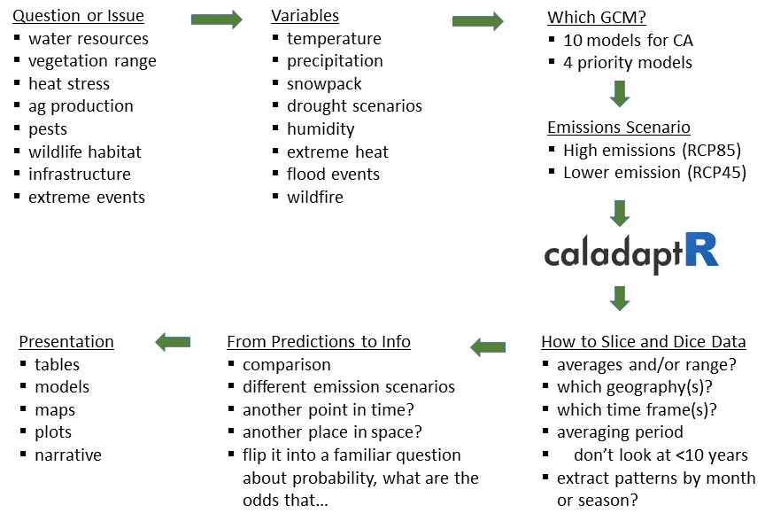

# About Me...

```{r setup, include = FALSE}
knitr::opts_chunk$set(echo = TRUE)
library(knitr)
library(kableExtra)
library(magrittr)
library(dplyr)
library(tidyr)
library(lubridate)
```

```{css echo = FALSE}
h1 {
  color:darkgreen;
}
h1.title {
  color:black;
  font-size:130%;
}
h2 {
  color:#444;
  font-size: 1.2em;
}
h3 {
  color:SeaGreen;
  line-height:100%;
}
.indented1 {
  margin-left:1em;
}
div.indented2 {
  margin-left:2em;
}

table.borderme {
  border:4px solid #246ABF;
  border-collapse:collapse;
}

table.borderme td {
  border: 1px solid #eee;
}

table.shademe td {
  background:#eee;
  padding:8px;
}

td.cp {
  text-align:center;
  font-size:90%;
  padding:30px;
}
div.li-single li {
  margin-bottom:0.1em;
} 
li {
  margin-bottom:0.1em;
} 
.test_delete {
  line-height:0.7em;
}
pre {
  font-weight:normal;
  font-size:80%;
}
p.warning {
  font-weight:bold;
  font-color:darkred;
  background-color:salmon;
  padding:10px;
}
```

<script type="text/javascript">w3c_slidy.mouse_click_enabled = false;</script>

```{r color, echo = FALSE, results='asis'}
# crayon needs to be explicitly activated in Rmd
options(crayon.enabled = TRUE)
# Hooks needs to be set to deal with outputs
old_hooks <- fansi::set_knit_hooks(knitr::knit_hooks, 
                                   which = c("output", "message", "error"))
```


# Introductions

Name

Where you're coming from

Interest in working with Cal-Adapt data in R

# Outline

<div class = "indented1 li-single">

**Section 1: Intro**  

<div class = "indented2">
- Notebook 1: Explore Merced’s Past and Future Climate
</div>

**Section 2: Finding Cal-Adapt Data & Using it Wisely**   
 
**Section 3: Data Munging Methods** 

<div class = "indented2">
- Notebook 2: Data Munging Techniques
</div>

**Section 4: Joining Tables and Mapping**  

<div class = "indented2">
- Notebook 3: Join Tables and Make Maps   
</div>

**Section 5: Techniques for Querying Large Data**  

**Wrap Up and How to Learn More**  

**Break** (~11:00a)

**Optional Q&A; work on your own data; continue working on notebooks** (11:00-11:30am)

</div>

# Goals

**1\) Hands-on practice with:**

a) importing Cal-Adapt into R via the API  
b) multi-purpose data munging techniques to prepare data for visualization or analysis  

**2\) Feedback on:**

a) bugs and confusing messages!
b) use cases for analyses and visualization

\

## Learning Strategy

{style="width:400px;"}

<div style="text-align:center; width:400px; margin-left:100px; border-bottom:2px solid black;">
&#43; foundational concepts  
&#43; code recipes  
&#43; working examples  
&#43; practice  
</div>
<div style="text-align:center; width:400px; margin-left:100px;">
**functional pRoficiency!**
</div>

\

{style="margin-left:2em; border:1px solid grey;"}

# Why you might want to work with Cal-Adapt data in R

## Custom Visualization 
 
## Integrate results with other data
 
 <div class="indented2 li-single">
 - census data  
 - biodiversity / habitat  
 - economic data
 </div>
 
## Take advantage of other R packages

## Run custom models

## Research
 
## Custom decision support


# Options for Accessing Cal-Adapt Data

```{r getting_data_options, echo=FALSE, results='asis', cache=FALSE}
tbl_vec <- c("Feature", "Cal-Adapt website", "Cal-Adapt FTP", "{style='width:160px;'}",
             "{style='width:160px;'}",
             
             "Download rasters", "", "", "", "",
             "Statewide", "x", "x", "x", "",
             "User area-of-interest", "x", "", "planned", "partial",
             "10 recommended GCMs", "x", "x", "x", "x",
             "All 32 GCMs", "", "x", "x", "",
             
             "Query features", "", "", "", "",
             "Points (user-provided)", "x", "", "x", "x",
             "Lines (user-provided)", "x", "", "x", "",
             "Polygons (user-provided)", "x", "", "x", "x",
             "Polygons (presets, boundary layers)", "x", "", "", "x",
             
             "Other", "", "", "", "",
             "Grab values from preset charts", "x", "", "", "")

tbl_mat <- matrix(tbl_vec, byrow=TRUE, ncol=5)

knitr::kable(tbl_mat, format = "html", align = c("l", "c", "c", "c", "c"), table.attr="class='borderme'") %>% 
  column_spec(1, width = "15em") %>%
  row_spec(1, bold=TRUE, background = gray(0.80), color = "black", align = "c", extra_css = "padding:0.5em 1em;") %>% 
  row_spec(c(2,7,12), bold=TRUE, background = gray(0.9), italic = TRUE) %>% 
  kable_styling(full_width = FALSE)

```

More info:

<div class="indented2">
- [*Accessing Climate Data through Cal-Adapt*](https://cal-adapt.org/blog/2019/webinar-june-2019){target="_blank" rel="noopener"}, Cal-Adapt Quarterly Webinar, June 2019
</div>


# caladaptR Features

{style="display:block; width:680px; margin:1em auto;"}

## Key Features

<div class = "indented2 li-single">

- `caladaptr` is an **API client** package  
- main job is to provide low-level functions for **querying** and **importing** Cal-Adapt data via the API  
- intended audience is **experienced R users**  
- uses modern R programming standards:  

<div class = "indented1">
- pipe friendly functions  
- accepts and returns standard data classes (e.g., tibble, sf, [stars](https://r-spatial.github.io/stars/){target="_blank" rel="noopener"})
- units encoded in the results
- follows development guidelines from [rOpenSci](https://devguide.ropensci.org/){target="_blank"}  
</div>

</div>

\

## Main Capabilities

<div class = "indented2 li-single">
- Retrieve values or cropped rasters from *any* Cal-Adapt raster series  
- Query data based on user-provided points and polygons  
- Query data with preset areas-of-interest  
</div>

\

## "Beta" status

<div class = "indented2 li-single">
- actively under development with frequent updates  
- some updates may not be backward compatible  
- user feedback and input is extremely welcome
</div>

\

## Under Development

<div class = "indented2 li-single">
- testing and error trapping
- import cropped rasters  
- documentation, code recipes, Shiny apps
- CRAN submission in early 2021
</div>


# caladaptR workflow

In general, there are **five** steps to using caladaptR:

```{r echo = FALSE}
library(DiagrammeR)
grViz("digraph flowchart {
  node [fontname = Helvetica, shape = rectangle]
  tab1 [label = '@@1']
  tab2 [label = '@@2']
  tab3 [label = '@@3']
  tab4 [label = '@@4']
  tab5 [label = '@@5']

  # edge definitions with the node IDs
  tab1 -> tab2 -> tab3 -> tab4 -> tab5;
  }

  [1]: '1) Determine your location(s) of interest\\nand assemble the required values/objects\\n\\ne.g., points, preset area-of-interest, own polygon'
  [2]: '2) Create an API Request object\\n\\ndataset, emissions scenario, date range, temporal resolution'
  [3]: '3) Feed the API Request into a function that fetches data'
  [4]: '4) Munge the results into the format you require\\n\\ne.g., filtering, sorting, joining, reshaping,\\nadd calculated columns, etc.'
  [5]: '5) Continue on with your analysis or visualization'")
```


# Quick Example

1. Load the package:

```{r load_package, cache = FALSE}
library(caladaptr)
```

2. Create an API request object:

```{r cap1_make, cache = TRUE}
pt1_cap <- ca_loc_pt(coords = c(-121.4687, 38.5938)) %>%  ## specify a location
  ca_cvar(c("tasmax", "tasmin")) %>%                   ## climate variables
  ca_gcm(c("HadGEM2-ES","CNRM-CM5","CanESM2",          ## GCM(s)
           "MIROC5")) %>%                              ##
  ca_scenario(scenarios[1:2]) %>%                      ## emission scenarios(s)
  ca_period("year") %>%                                ## temporal aggregation period
  ca_years(start = 2040, end = 2060)                   ## start and end dates

pt1_cap
```

3. Fetch data:

```{r cap1_fetch, cache = TRUE}
pt1_tbl <- ca_getvals_tbl(pt1_cap, quiet = TRUE)
```

4. View the results

```{r}
pt1_tbl
```


# Building an API Request

An API Request object consists of 2-4 pieces:

**1. Location** (*required, use one of the following*)

```{r api_constructors_loc, echo=FALSE, results='asis', cache=TRUE}
col1_width <- "12em"

tbl_vec <- c("ca_loc_aoipreset()", "Query a preset location(s)",
             "ca_loc_pt()", "Question point location(s)",
             "ca_loc_sf()", "Query simple feature location(s)")

kable(matrix(tbl_vec, byrow=TRUE, ncol=2), 
      format = "html", align = c("l", "l"), table.attr="class='shademe'") %>% 
  column_spec(column = 1, monospace = TRUE, width = col1_width) %>%
  kable_styling(full_width = FALSE, position = "left")
```

\

**2. Raster series dataset** (*required*)

<div class="indented1">

<span style="color:darkgreen; font-weight:bold;">Option 1</span>: Choose downscaled climate projection(s) from Scripps using **all 4** of the following constructor functions:

```{r api_const_loca, echo=FALSE, results='asis', cache=FALSE}
library(magrittr); library(kableExtra)

tbl_vec <- c("ca_cvar()", "Select the climate variable(s) (i.e., precip, temperature)",
             "ca_gcm()", "Pick or more of the 10 Global Climate Models",
             "ca_period()", "Select temporal aggregation period (year, month, day)",
             "ca_scenario()", "Choose your emission scenario(s)")

knitr::kable(matrix(tbl_vec, byrow=TRUE, ncol=2), 
      format = "html", align = c("l", "l"), table.attr="class='shademe'") %>% 
  kableExtra::column_spec(column = 1, monospace = TRUE, width = col1_width) %>% 
  kableExtra::kable_styling(full_width = FALSE, position = "left")
```

<span style="color:darkgreen; font-weight:bold;">Option 2</span>: Pick *any* of the 850 raster series datasets by their '**slug**':

```{r api_const_slug, echo=FALSE, results='asis', cache=FALSE}
tbl_vec <- c("ca_slug()", "Select a dataset by its slug")
knitr::kable(matrix(tbl_vec, byrow=TRUE, ncol=2), 
      format = "html", align = c("l", "l"), table.attr="class='shademe'") %>% 
  kableExtra::column_spec(column = 1, monospace = TRUE, width = col1_width) %>% 
  kableExtra::kable_styling(full_width = FALSE, position = "left")
```

</div>

\

**3. Start & end dates** (*optional, pick one*)

```{r api_const_start_end, echo=FALSE, results='asis', cache=FALSE}
library(magrittr)
tbl_vec <- c("ca_years()", "Specify start & end by **year**",
             "ca_dates()", "Specify start & end by **date**")
knitr::kable(matrix(tbl_vec, byrow=TRUE, ncol=2), 
      format = "html", align = c("l", "l"), table.attr="class='shademe'") %>% 
  kableExtra::column_spec(column = 1, monospace = TRUE, width = col1_width) %>% 
  kableExtra::kable_styling(full_width = FALSE, position = "left")
```

\

**4. Options** (*only required for polygons*)

```{r api_options, echo=FALSE, results='asis', cache=FALSE}
library(magrittr)
tbl_vec <- c("ca_options()", "Spatial aggregation function(s)")
knitr::kable(matrix(tbl_vec, byrow=TRUE, ncol=2), 
      format = "html", align = c("l", "l"), table.attr="class='shademe'") %>% 
  kableExtra::column_spec(column = 1, monospace = TRUE, width = col1_width) %>% 
  kableExtra::kable_styling(full_width = FALSE, position = "left")
```

# Preset Areas-of-Interest

The Cal-Adapt API server has 11 preset **areas of interest** (aka boundary layers).

<div class="li-single" style="float:left; width=450px; margin-left:2em;">
- Census Tracts
- Counties
- Congressional Districts
- Climatic Regions
- Watersheds
- Irrigated Water Management Districts
</div>

<div class="li-single" style="float:left; width=450px;">
- 4th Climate Change Assessment Regions
- Electrical Utilities
- WECC Load Areas
- Event Locations
- Places  
</div>

<div style="clear:both;"></div>

You can query these features **without passing a spatial object**!

Example:

```{r cap2, cache=FALSE}
library(caladaptr)
cap2 <- ca_loc_aoipreset(type = "counties", 
                         idfld = "fips", 
                         idval = c("06105", "06049", "06089", "06015")) %>% 
  ca_gcm(gcms[1:4]) %>%
  ca_scenario(scenarios[1:2]) %>%
  ca_period("year") %>%
  ca_years(start = 2040, end = 2060) %>%
  ca_cvar("pr") %>% 
  ca_options(spatial_ag = "max")
```

Plot an API request to verify the location:

```{r plot_cap2, message = FALSE, warning = FALSE}
plot(cap2)
```

# Exercise #1: [Explore Merced’s Climate Past and Future](nb1.nb.html)


<p class="warning">We don't want to overload the server during the workshop!<br/>
Please stick to the code examples in the R Notebook.</p>

## RStudio Cloud Users

In the Files pane, click on **nb1.Rmd** to open it.

\

## RStudio Desktop Users

If you haven't already, download the exercises by running:

```
usethis::use_course("https://github.com/ucanr-igis/caladaptr-res/raw/main/docs/workshops/caladaptr_intro_dec20.zip")
```

Expand the zip file to to the destination of your choice.

Double-click **nb1.Rmd** to open it in RStudio


# Section 2: Finding Climate Data & Using it Wisely

## From Questions to Data to Answers



# Cal-Adapt Datasets 

See also: <https://berkeley-gif.github.io/caladapt-docs/data-catalog.html>

## Primary Data

<div class = "indented1">

### LOCA Downscaled Projected Climate Variables (Scripps)

<div class = "indented1 li-single">
- temperature & precipitation   
- downscaled from 100km to 6km using LOCA method  
- 1950-2005 (modelled historical) & 2005-2100 (modelled future)
- 10 GCMs, 3 scenarios, envelope  
- <span style="color:darkgreen;"> &#8658; to import these into R, build your API request with `ca_cvar()` + `ca_scenario()` + `ca_gcm()` + `ca_period()`</span>
</div>

\

### Additional hydrological variables from the Variable Infiltration Capacity (VIC) model

<div class = "indented1 li-single">
- variables include snow water equivalent, evapotranspiration, air temperature, baseflow, runoff, rainfall, snowfall, soil moisture  
- based on downscaled LOCA data with additional modeling  
- 1950-2005 (modelled historical) & 2005-2100 (modelled future)
- 10 GCMs, 3 scenarios  
- <span style="color:darkgreen;"> &#8658; to import these into R, use  `ca_slug()` in your API request</span>
</div>

\

### Gridded Historical *Observed* Climate Data (Livneh)

<div class = "indented1 li-single">
- temperature and precipitation  
- 1950-2013  
- <span style="color:darkgreen;"> &#8658; to import these into R, use  `ca_slug()` in your API request</span>
</div>

\

### Additional VIC variables from Gridded Historical Climate Data (Livneh + VIC)

<div class = "indented1 li-single">
- daily baseflow, ET, swe, runoff, air temp
- 1950-2013
- <span style="color:darkgreen;"> &#8658; to import these into R, use  `ca_slug()` in your API request</span>
 </div>

</div>

\

## Other Raster Series

<div class = "indented1">

<div class = "indented1 li-single">
- flooding (Radke)
- wildfire probability (Merced)
- various rasters created to run tools on Cal-Adapt.org
- station (point) data 
</div>
</div>


# Raster Series Catalog

`caladaptR` comes with a Raster Series Catalog 

For each raster series the catalog will list its:

<div class = "indented1 li-single">
- full name  
- slug (unique identifier)  
- begin and end date  
- temporal resolution  
- units  
- extent  
- number of rasters  
</div>

The catalog can be retrieved using  `ca_catalog_rs()` (returns a tibble). 

The best way to browse the catalog is with RStudio's View pane. You can then use the filter buttons to find the raster series you want. 

```{r eval=FALSE}
View(ca_catalog_rs())
```

```{r show_catalog, echo = FALSE}
rs_cat_tbl <- caladaptr::ca_catalog_rs(quiet = TRUE) %>% 
  dplyr::select(name, slug, url) %>% 
  tibble::as_tibble()

DT::datatable(rs_cat_tbl, 
          class = 'row-border stripe hover compact', 
          rownames = F, 
          autoHideNavigation = T, 
          escape =FALSE)
```

Tip: you can download a fresh copy of the Raster Series Catalog with `ca_catalog_fetch()`.

You can also find slugs at <https://api.cal-adapt.org/api/series/> &rarr; click on 'Filters'

\

## Specify a Raster Series by Slug

To specify a dataset by slug, use **`ca_slug()`** when creating your API request:

```{r}
cap_et <- ca_loc_pt(coords = c(-121.4687, 38.5938)) %>%
  ca_slug("ET_month_MIROC5_rcp45") %>%
  ca_years(start = 2040, end = 2060)

cap_et
```

Note: `ca_slug()` is incompatible with `ca_gcm()`, `ca_scenario()`, `ca_cvar()`, and `ca_period()`.

# LOCA Downscaled Grid Extent

You can download the LOCA grid with `ca_locagrid_geom()`.

Raster series that has been LOCA downscaled will have this extent:

```{r cache = TRUE, message=FALSE}
locagrid_sf <- ca_locagrid_geom(quiet = TRUE)

library(tmap)
tmap_mode("plot")
tm_shape(locagrid_sf) + 
  tm_polygons() +
tm_shape(USAboundaries::us_states(states = c("CA", "NV", "OR", "ID", "AZ", "UT"), resolution = "low")) +
  tm_borders(col = "yellow", lty = 2) +
tm_layout(main.title = "Extent of LOCA Downscaled Raster Series",
          main.title.size = 0.9)
```

# Querying a User-Defined Polygon

An API request can use a simple feature data frame as the query location (point, polygon, and multipolygon).

Use `sf::st_read()` to import Shapefiles, geojson, KML, geopackage, ESRI geodatabases, etc.

```{r}
library(sf)
pinnacles_bnd_sf <- st_read("data/pinnacles_bnd.geojson")
pinnacles_bnd_sf
```

Crate an API request:

```{r}
pin_cap <- ca_loc_sf(loc = pinnacles_bnd_sf,
                     idfld = "UNIT_CODE") %>% 
  ca_slug("ET_month_MIROC5_rcp45") %>%
  ca_years(start = 2040, end = 2060)

plot(pin_cap, locagrid = TRUE)
```

# Using Climate Data *Wisely*


<div style="border:3px solid gray; background-color:#DAF7A6;">

## Short version:

<div class = "indented1 li-single">
- Climate models tell us something about projected "*climate*" (weather averaged over 20-30 years).  
- If you're doing *anything* with modeled climate data that doesn't involve a 20-30 year average, you're probably doing it wrong.
- That includes characterizing historic conditions!
</div>

</div>

\

## Best Practice #1: Aggregate, aggregate, aggregate

<div class = "indented1 li-single">
- don't look at specific points in space or time  
- average years together  
- average models together  
- take rolling averages  
- interested in an area? spatially aggregate  
</div>

Two properties critical to report about aggregations: 

<div class = "indented1 li-single">
- central tendency  
- distribution / spread  
</div>

\

## Best Practice #2: Compare, compare, compare

<div class = "indented1 li-single">
- Compare projected future against historical conditions  
- Compare emission scenarios  
- Compare Place A vs Place B  
</div>

\

## Good Practice #3: Turn Climate Values Into Probability Statements

Hard to interpret: *"The average temperature will be 1.3 degrees F warmer..."*

Better:

<div class = "indented1 li-single">
- What is the likelihood of x?  
- What will be the expected demand for y?  
- What will a 100-year event look like?  
</div>

\

## How to Look Backward

<div class = "indented1 li-single">
- model historic data: compare apples to apples
- observed historic data: intuitive (although still modelled)
</div>


# Data Munging Techniques

Cal-Adapt data always comes down in a "long" format:

```{r}
head(pt1_tbl)
```

To make useful plots, maps, and summaries, you often have to 'munge' or 'wrangle' the data, which may include:

<div class = "indented1 li-single">
- selecting columns  
- filtering rows
- changing column data type  
- calculating new columns  
- grouping rows; summarizing  
- reshaping long to wide (aka pivoting)  
</div>

\

Fortunately you have a very robust toolbox:

<table><tr>

<td class="cp"><br/>
[cheatsheet](https://github.com/rstudio/cheatsheets/blob/master/data-transformation.pdf)</td>

<td class="cp">{height="150"}<br/>
[cheatsheet](https://github.com/rstudio/cheatsheets/blob/master/data-import.pdf)</td>

<td class="cp">{height="150"}<br/>
[cheatsheet](https://github.com/rstudio/cheatsheets/blob/master/sf.pdf)</td>

<td class="cp">{height="150"}<br/>
[cheatsheet](https://rstudio.com/wp-content/uploads/2016/11/ggplot2-cheatsheet-2.1.pdf)</td>

</tr></table>

Useful functions

<div class = "indented1 li-single">
- filter()
- select()
- mutate()
- group_by()
- summarise()
- left_join()
- pivot_wider()
</div>

**Qtn.** How do I know what data munging is needed?

**Ans.** Work backward from your analysis or visualization functions.

# Exercise

Notebook 2: [Data Munging Techniques](nb2.nb.html)

# Joining Tables and Mapping

The first column of every climate data tibble is the feature id:

```{r}
head(pt1_tbl)
```

We can use this to join the results back to other tables. The function you'll use most often to join tables is `left_join()` from `dplyr`:

left_join(x, y, by = NULL)

Where `by` is the name of the column that x and y have in column. If the join column has different names in x and y, pass a named vector to by.

`left_join()` also works with simple feature data frames, so you can use climate values in map symbology!

# Exercise

Notebook 3: [Join Tables and Make Maps](nb3.nb.html)

# Querying Large Data

Imagine you want to extract the climate data for 36,000 vernal pool locations.

Issues that arise when querying large number (1000s) of locations:

<div class = "indented1 li-single">
- R tries to load everything in memory   
- long times to download data  
- server overload  
</div>

## General Strategies

**1) Aggregate point features by LOCA grid cells **

<div class = "indented2">
- The same API call can be used for all points in the same LOCA grid cell
</div>

**2) Download rasters**

<div class = "indented2">
- `ca_getrst_stars()`
- Although it will take longer to download, data extraction and geoprocessing may be faster locally
</div>

**3) Save values in a local SQLite database**

<div class = "indented2">
- `ca_getvals_db()`  
- values get saved as they are received
</div>

\

# Saving Values to a Local Database

Use `ca_getvals_db()` Instead of `ca_getvals_tbl()`

Sample usage:

```
my_vals <- ca_getvals_db(my_api_req,
                         db_fn = "my_data.sqlite",
                         db_tbl = "daily_vals",
                         new_recs_only = TRUE)
```

`new_recs_only = TRUE` &rarr; will pick up where it left off if the connection interrupted  

`ca_getvals_db()` returns a 'remote tibble' linked to a local database

Work with 'remote tibbles' using many of the same techniques as regular tibbles (a few exceptions)

`ca_db_info()` and `ca_db_indices()` help you view and manage database files

Upcoming Vignette will have details

\

# Cropped Rasters

Feed the API request to `ca_getrst_stars()`

Largest area you can request is approximately the size of San Bernadino County, CA

(user-provided polygons currently not working)

Upcoming Vignette will have details

# Wrap-Up

{style="display:block; width:680px; margin:1em auto;"}

Once you get Cal-Adapt data into R, there's a lot you can do with it!

Ho


